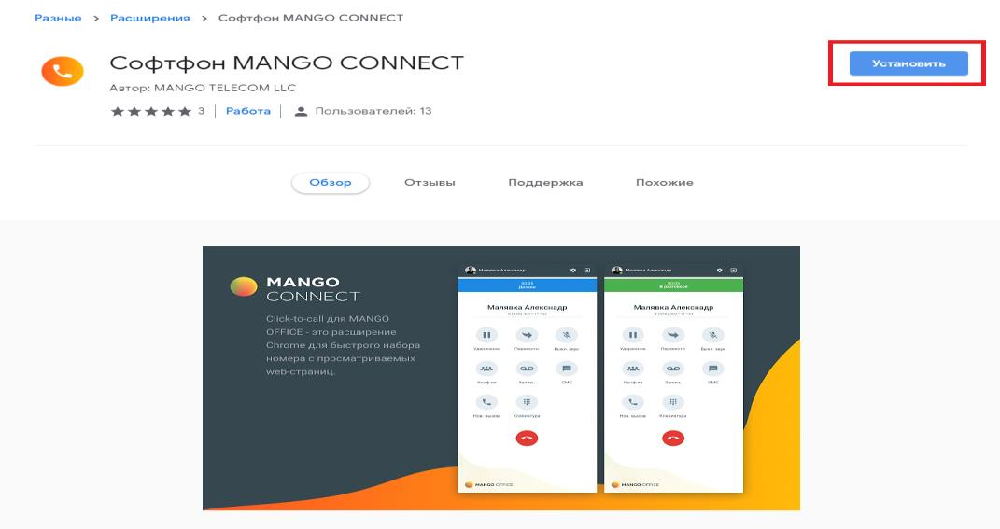
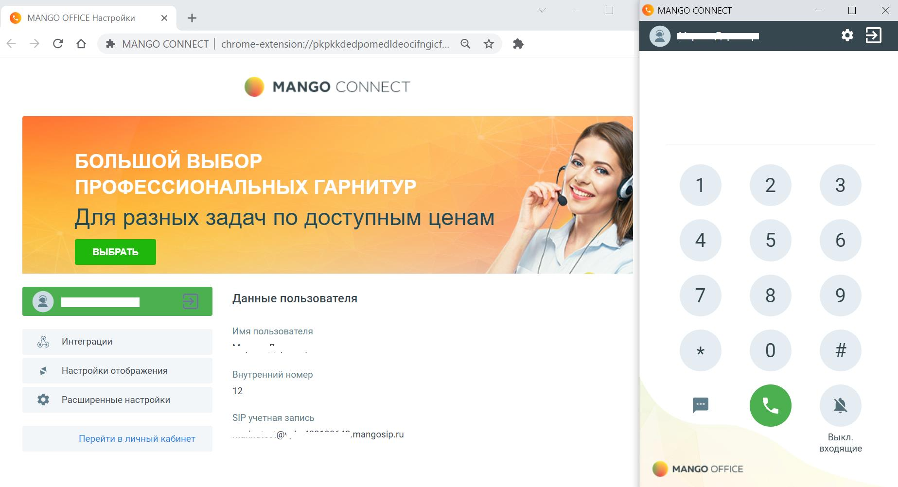
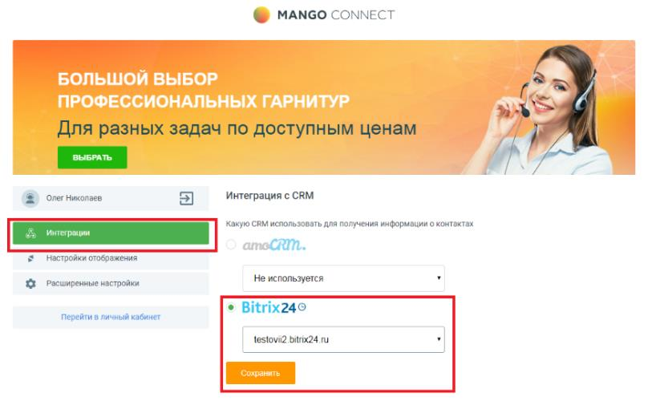

# 5.1. Описание

> Трассировка: PDF §5.1 · сквозные стр. 163-167 · источники: ч.1 `kb/sources/integration-bitrix24/Mango_office_integration_Bitrix24.pdf` с.163-167.

Софтфон "MANGO CONNECT" - расширение для Google Chrome, которое при интеграции виртуальной АТС с CRM-системой позволит звонить, принимать вызовы и отправлять SMS из окна браузера. Работает с Битрикс24 и только при наличии услуги "Расширенные возможности интеграции". Внимание! Браузерный софтфон MANGO CONNECT предназначен только для работы в браузере Chrome! Для установки софтфона перейдите в Chrome по ссылке - скачать Софтфон MANGO CONNECT Чтобы звонить из браузера требуется только установленное расширение MANGO CONNECT и гарнитура. Все функции MANGO CONNECT: • прием входящих звонков; • работа в режиме "Не беспокоить" / DND, в котором все входящие вызовы автоматически сбрасываются; • набор номера на клавиатуре или с помощью номеронабирателя в приложении; • исходящие звонки по клику из CRM-системы; • возможность набора DTMF-команд при дозвоне на голосовое меню; • перевод вызова на другого сотрудника или внешний номер; • запись разговора во время звонка; • отключение звука во время разговора; • постановка вызова на удержание; • отображение имени или телефона Клиента; • отправка SMS из приложения; • всплывающее уведомление и звуковое оповещение при входящем звонке; • приложение работает со всеми гарнитурами. Интеграция Виртуальной АТС MANGO OFFICE и Битрикс24 | Версия от 03.03.2026

Установку расширения необходимо выполнить каждому сотруднику. 1. нажмите "Установить"

Интеграция Виртуальной АТС MANGO OFFICE и Битрикс24 | Версия от 03.03.2026 2) подтвердите разрешение на установку:

3) ввести данные SIP ID сотрудника и пароля; 4) нажать на кнопку "Войти":

Интеграция Виртуальной АТС MANGO OFFICE и Битрикс24 | Версия от 03.03.2026 5) после успешной авторизации пользователя будут показаны настройки расширения и окно софтфона:

6) после авторизации уже можно звонить и принимать звонки;

7) нажмите на кнопку окне софтфона (см. рисунок выше) и в открывшихся настройках укажите ваш домен в CRM и сохраните:

8) Софтфон MANGO CONNECT настроен на работу с CRM. Интеграция Виртуальной АТС MANGO OFFICE и Битрикс24 | Версия от 03.03.2026
