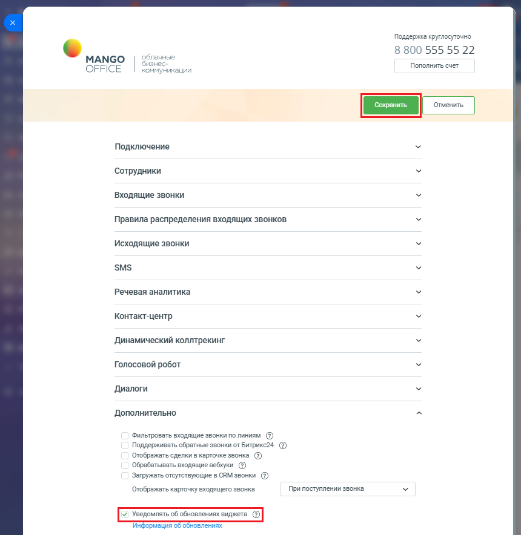

# 7. Обновление приложения

> Трассировка: PDF §7 · сквозные стр. 169-170 · источники: ч.1 `kb/sources/integration-bitrix24/Mango_office_integration_Bitrix24.pdf` с.169-170.

Команда разработки постоянно работает над улучшениями приложения интеграции MANGO OFFICE с Битрикс24. Чтобы вам стали доступны новые возможности, обновите приложение. При появлении нового обновления приложения – над формой настройки приложения вы увидите уведомлении о появлении новой версии. Кликните на "Перейти к установке" и пройдите процесс обновления. Все настройки интеграции будут сохранены! Вы можете включить или выключить показ уведомления о новой версии приложения. Для этого: 1) откройте форму настройки приложения интеграции, откройте блок "Дополнительно"; 2) установите флаг "Уведомлять об обновлениях виджета", чтобы включить показ уведомлений, либо снимите этот флаг, чтобы выключить показ уведомлений; Примечание. Нажав на ссылку "Информация об обновлениях", вы перейдете на сайт MANGO OFFICE, на котором показан список обновлений приложения. 3) нажмите кнопку "Сохранить" в верхней части формы настройки приложения интеграции:

Интеграция Виртуальной АТС MANGO OFFICE и Битрикс24 | Версия от 03.03.2026
