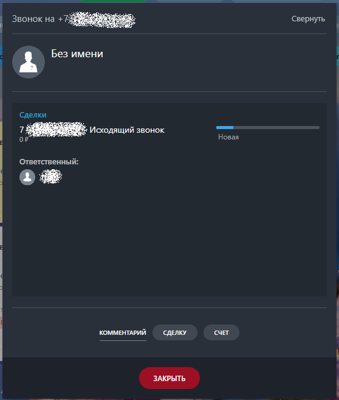
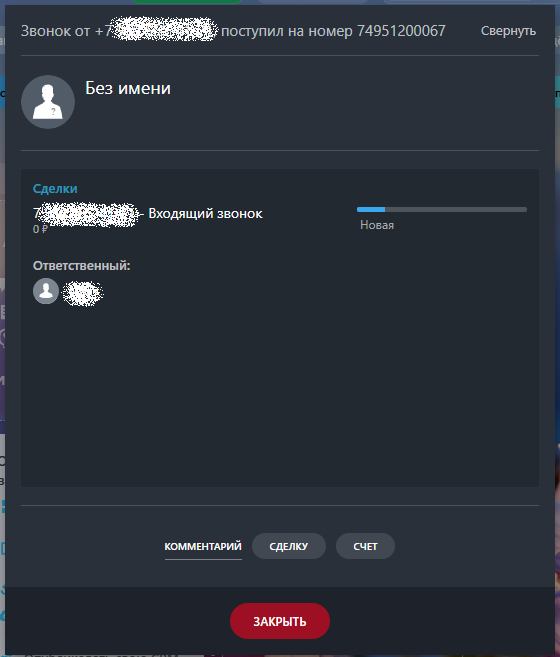

# 1.5. Как позвонить или принять звонок

> Трассировка: PDF §1.5 · сквозные стр. 23-25 · источники: ч.1 `kb/sources/integration-bitrix24/Mango_office_integration_Bitrix24.pdf` с.23-25.

Чтобы позвонить Клиенту (исходящий звонок), пользователь может: - кликнуть на номер телефона в Битрикс24. При этом, если сотрудник кликнул на номер телефона в Битрикс24, то сначала зазвонит его рабочий телефон, и только после того как сотрудник поднимет трубку – начнется звонок на выбранный номер телефона; - набрать номер в номеронабирателе Битрикс24; - набрать номер на экранной клавиатуре Mango Talker и нажать кнопку "Вызов". В Битрикс24 будет показана карточка исходящего звонка.

Интеграция Виртуальной АТС MANGO OFFICE и Битрикс24 | Версия от 03.03.2026 При входящем звонке у сотрудника зазвонит Mango Talker, либо его рабочий SIP-телефон и в Битрикс24 покажется карточка звонка:

Интеграция Виртуальной АТС MANGO OFFICE и Битрикс24 | Версия от 03.03.2026
