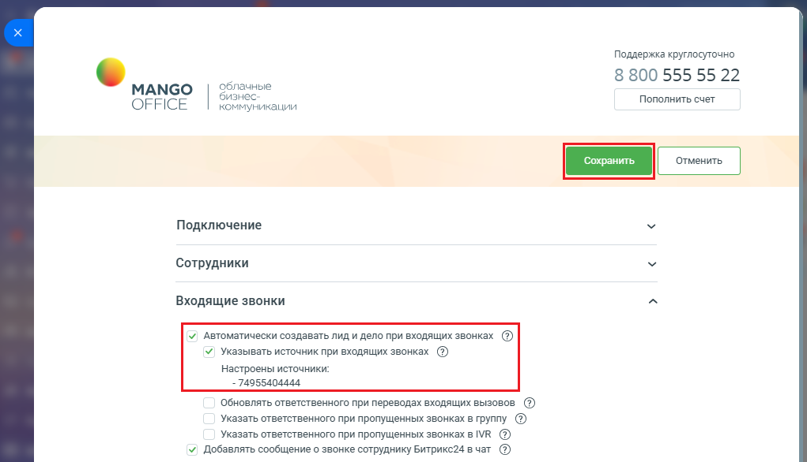
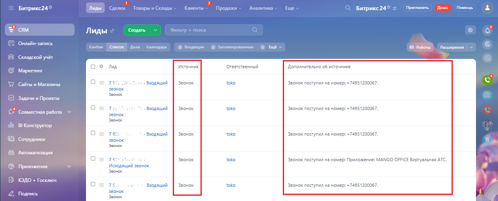

# Как включить настройку

> Трассировка: PDF §2.3 · сквозные стр. 38-39 · источники: ч.1 `kb/sources/integration-bitrix24/Mango_office_integration_Bitrix24.pdf` с.38-39.

Для того чтобы включить настройку "Указывать источник при входящих звонках", необходимо: 1) настройте справочник источников, если это не было сделано ранее; 2) откройте форму настройки приложения интеграции; 3) включите автосоздание лидов и дел при входящих звонках; 4) установите флаг "Указывать источник при входящих звонках"; 5) нажмите кнопку "Сохранить" в верхней части формы настройки приложения интеграции:

6) после включения настройки, при автоматическом создании лида при входящем звонке, в лиде сохраняется информация об источнике. Примечание. Как настроить отображение колонок в списке Лидов описано в приложении Б.

Интеграция Виртуальной АТС MANGO OFFICE и Битрикс24 | Версия от 03.03.2026
