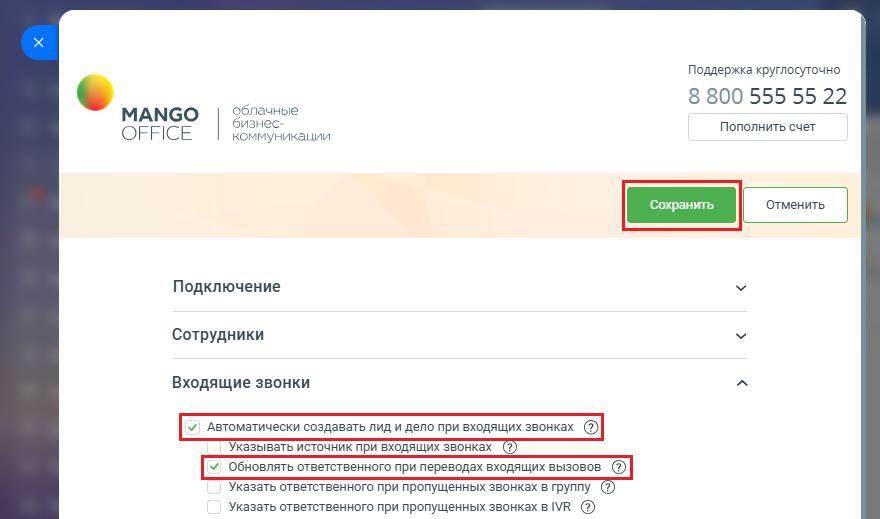

# Как включить настройку

> Трассировка: PDF §2.3 · сквозные стр. 39-40 · источники: ч.1 `kb/sources/integration-bitrix24/Mango_office_integration_Bitrix24.pdf` с.39-40.

1) откройте форму настройки приложения интеграции; 2) откройте блок "Входящие звонки"; 3) установите флаг "Обновлять ответственного при переводах вызовов". Настройка доступна, если ранее был включен флаг "Автоматически создавать лид при входящих звонках"; 4) нажмите кнопку "Сохранить" в верхней части формы настройки приложения интеграции:

Интеграция Виртуальной АТС MANGO OFFICE и Битрикс24 | Версия от 03.03.2026
