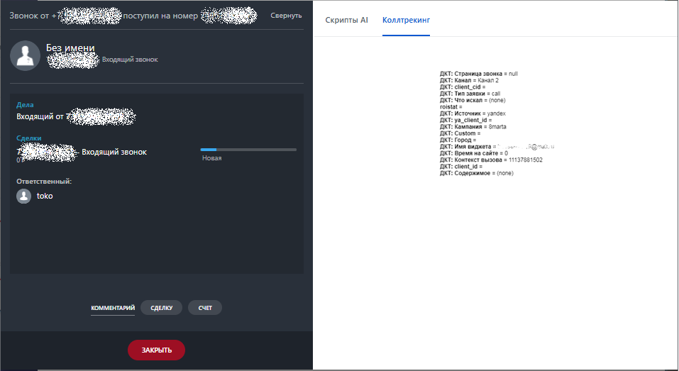
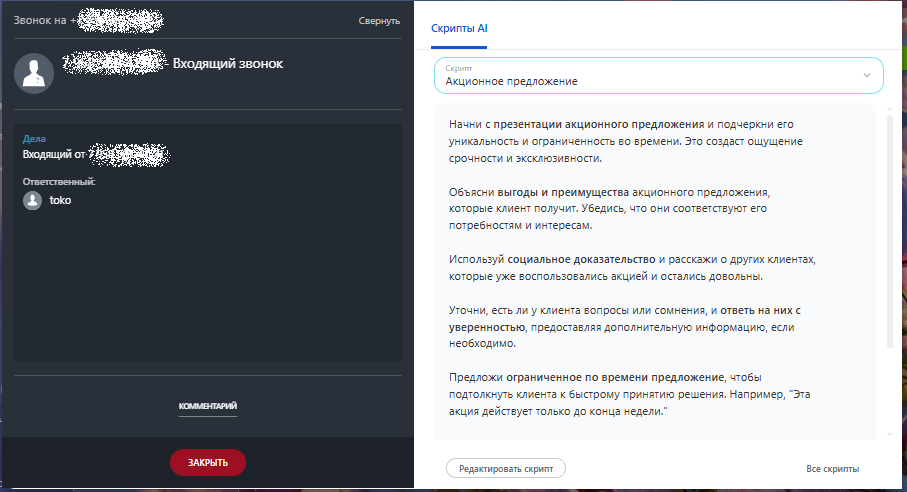
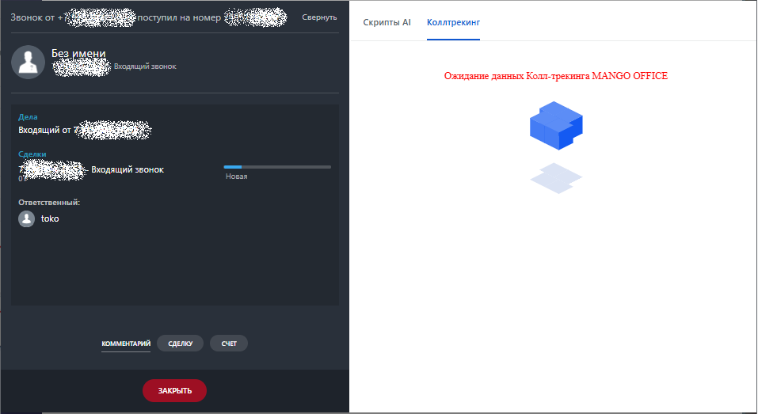

# Во время звонка

> Трассировка: PDF §2.3 · сквозные стр. 43-45 · источники: ч.1 `kb/sources/integration-bitrix24/Mango_office_integration_Bitrix24.pdf` с.43-45.

Если вы подключили интеграцию с динамическим коллтрекингом, а также настроили динамический коллтрекинг, то: - при входящем звонке от Клиента, в карточке звонка будут показаны данные коллтрекинга. Отображаемые в карточке звонка данные коллтрекинга изменить невозможно. Пример отображения данных коллтрекинга показан на рисунке:

Интеграция Виртуальной АТС MANGO OFFICE и Битрикс24 | Версия от 03.03.2026 • при исходящем звонке данные коллтрекинга не отображаются:

Если во время звонка в интеграцию еще не поступили данные коллтрекинга, в карточке звонка в Битрикс24 будет показано сообщение "Ожидание данных Коллтрекинга MANGO OFFICE". Пример отображения данных коллтрекинга показан на рисунке:

Интеграция Виртуальной АТС MANGO OFFICE и Битрикс24 | Версия от 03.03.2026
