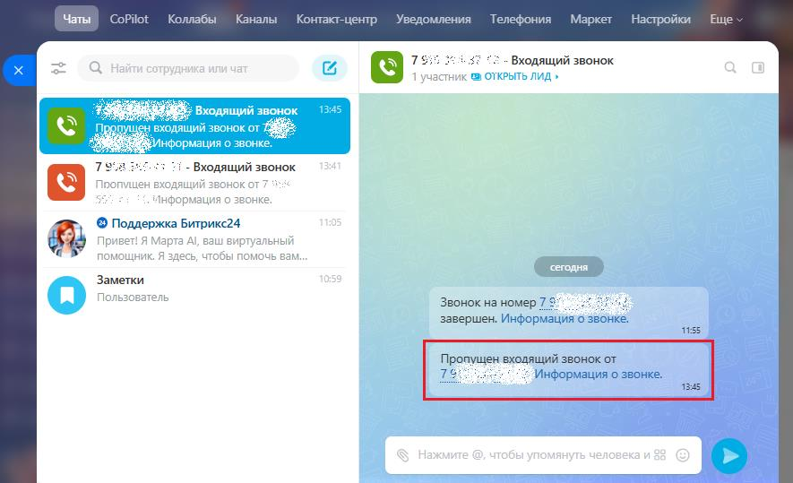
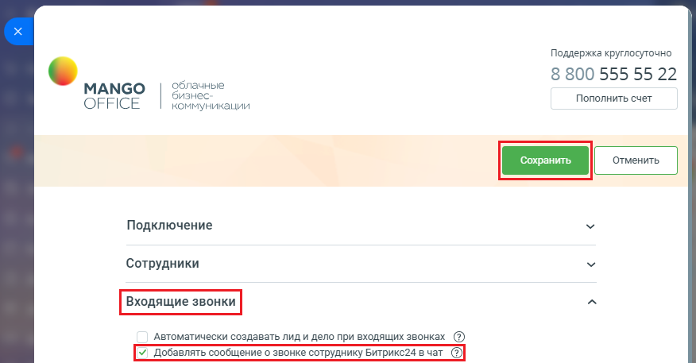

# Добавлять сообщение о звонке сотруднику Битрикс24 в чат

> Трассировка: PDF §2.3 · сквозные стр. 47-48 · источники: ч.1 `kb/sources/integration-bitrix24/Mango_office_integration_Bitrix24.pdf` с.47-48.

Важно! Настройка доступна только для расширенного пакета интеграции. Для каждого звонка Клиента может быть передано сообщение в чат Открытых линий. Например, оператор может завершить беседу с Клиентом, тогда в чате появится уведомление вида: Входящий звонок от 7 499 110-03-44 завершен. Информация о звонке Тогда все ваши сотрудники будут знать о поступившем звонке и могут посмотреть информацию об этом звонке. Важно! Настройка не влияет на сохранения факта звонка, т.е. как и прежде информация о звонке будет доступна в карточке лида/контакта, в разделе Телефония и т.д. По умолчанию настройка включена.

Интеграция Виртуальной АТС MANGO OFFICE и Битрикс24 | Версия от 03.03.2026 Чтобы скрыть уведомления в чат для звонков, вы можете выключить эту настройку. Для этого в форме настройки приложения интеграции: 1) откройте блок "Входящие звонки"; 2) снимите флаг "Добавлять сообщение о звонке сотруднику Битрикс24 в чат"; 3) нажмите кнопку "Сохранить" в верхней части окна настроек. Информация о звонках НЕ будут добавляться в чат Открытых линий:

