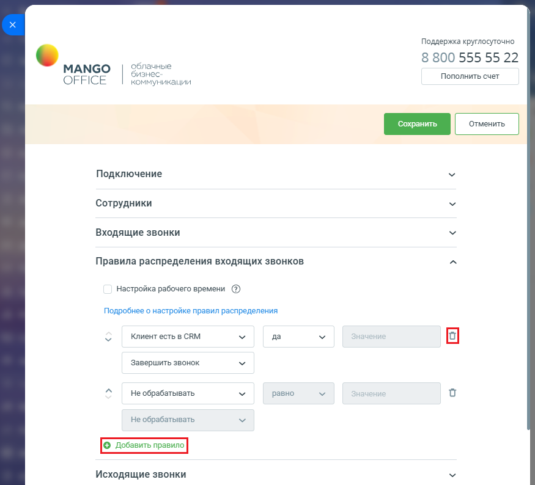
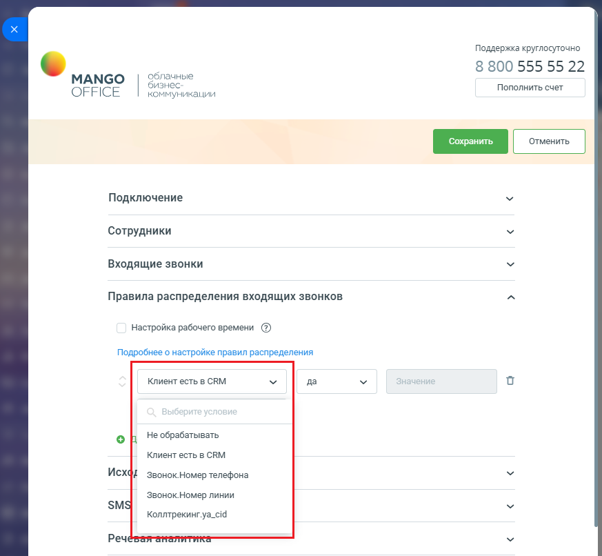
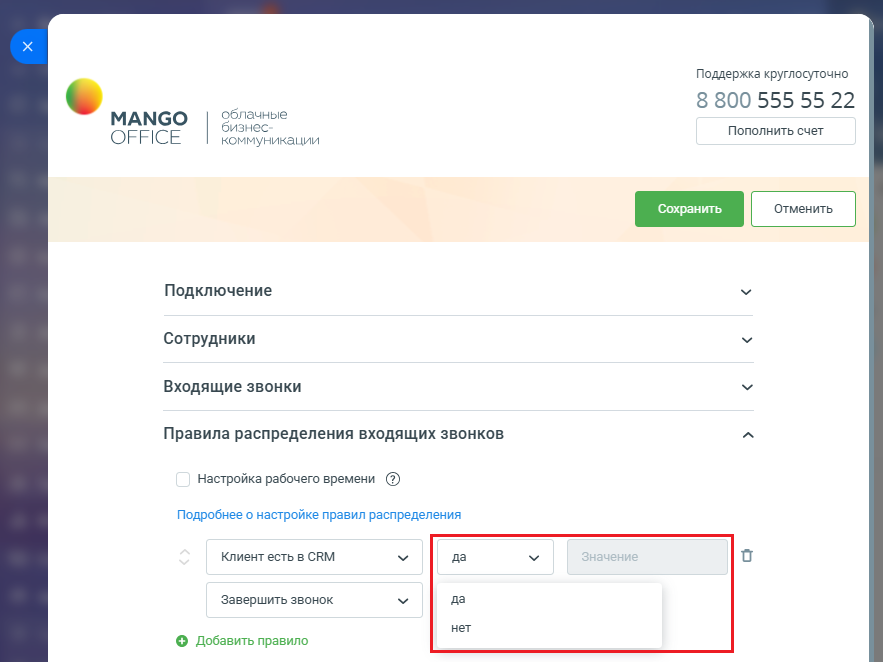
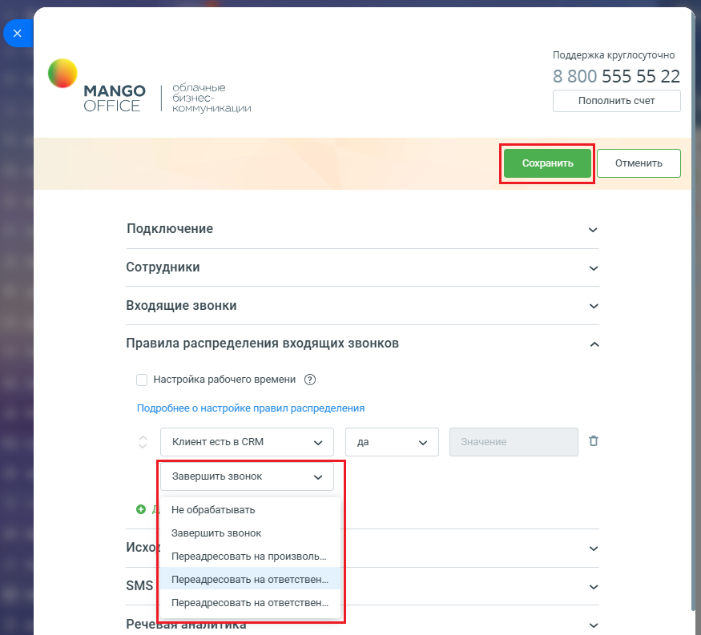

# Как настроить распределение звонков в приложении интеграции

> Трассировка: PDF §2.3 · сквозные стр. 50-53 · источники: ч.1 `kb/sources/integration-bitrix24/Mango_office_integration_Bitrix24.pdf` с.50-53.

Вы можете настроить собственный алгоритм распределения, указав правила разработки в группе полей "Правила распределения входящих звонков". Можно указать до 10 правил, при звонке правила анализируются в настроенном порядке, сверху-вниз. Для изменения порядка правил

нажимайте на стрелки вверх ( ) и/или вниз ( ) необходимое количество раз.

Чтобы настроить распределение звонков, необходимо: 1) откройте форму настройки приложения интеграции; 2) откройте блок "Правила распределения входящих звонков"; 3) для добавления нового правила нажмите кнопку "Добавить правило", для

удаления кнопку "Корзина" ;

Интеграция Виртуальной АТС MANGO OFFICE и Битрикс24 | Версия от 03.03.2026 4) при настройке правила укажите какое значение анализировать: • из данных коллтрекинга о текущем звонке (если на вкладке "Дополнительно" включена интеграция с Динамическим коллтрекингом и к Виртуальной АТС подключен коллтрекинг). К примеру, Коллтрекинг.medium; • из данных коллтрекинга, ранее сохраненных в CRM (к примеру, Контакт.ДКТ:Город); • из Битрикс24 (для этого в Битрикс24 выполняется поиск по номеру звонящего и для найденного Клиента выполняется анализ данных) – для лидов, контактов, сделок. По всем полям, в том числе пользовательским;

Интеграция Виртуальной АТС MANGO OFFICE и Битрикс24 | Версия от 03.03.2026 5) укажите операцию сравнения ("равно", "не равно", "содержит" и т.д.) и укажите с каким значением необходимо сравнивать;

6) укажите какое действие необходимо выполнить, если результат проверки будет успешным (переадресовать на номер, переадресовать на ответственного, переадресовывать на ответственного и переадресовывать далее на номер, если нет ответа и другие); Примечание. Настройте правила так, как вам нужно, руководствуясь примерами, описанными далее. 7) нажмите кнопку "Сохранить" в верхней части формы настройки приложения интеграции. Будет выполнена проверка настройки умных правил, а также проверка корректной настройки схемы распределения вызовов. Если нет проблем, то настройки работы умных алгоритмов будут сохранены, иначе будет выдано сообщение; 8) настройте расписание работы умных алгоритмов. Интеграция Виртуальной АТС MANGO OFFICE и Битрикс24 | Версия от 03.03.2026

