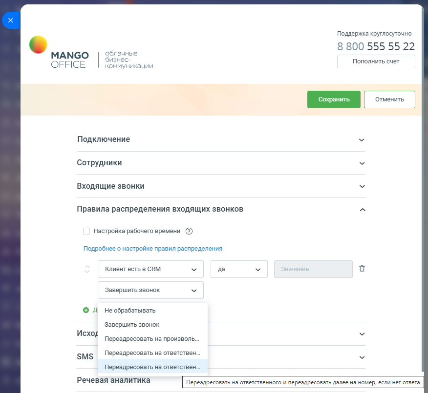
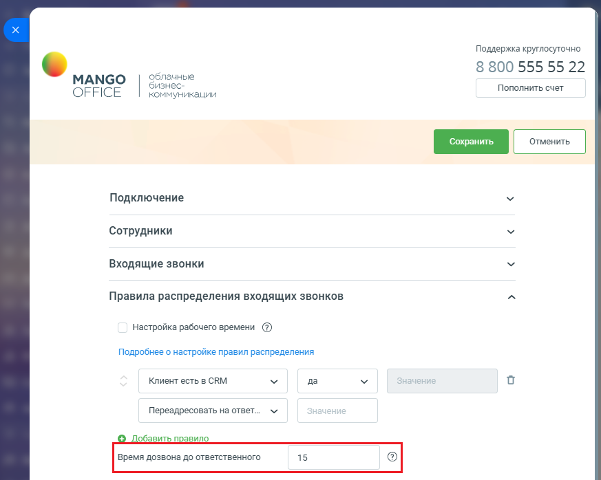
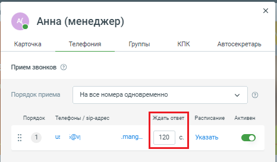

# Значение "Переадресовывать на ответственного и переадресовывать далее на номер, если нет ответа"

> Трассировка: PDF §2.3 · сквозные стр. 54-56 · источники: ч.1 `kb/sources/integration-bitrix24/Mango_office_integration_Bitrix24.pdf` с.54-56.

номер, если нет ответа" Данное значение вы можете выбрать в качестве "действия, которое нужно выполнить умному алгоритму над звонком" (см. шаг 6 "Как настроить распределение звонков в приложении интеграции"):

Интеграция Виртуальной АТС MANGO OFFICE и Битрикс24 | Версия от 03.03.2026 Если звонок соответствует условию, то он будет переадресован на сотрудника, ответственного за звонок, при этом, если ответственный не принял вызов, то звонок будет переадресован далее на указанный вами номер телефона. По умолчанию, виджет дозванивается до ответственного в течение 15 секунд. Чтобы определить время дозвона до ответственного сотрудника, используйте опцию "Время дозвона до ответственного". Тогда виджет интеграции будет дозваниваться до ответственного определенное Вами количество секунд, по истечении которых переадресует вызов на указанный вами номер.

Обратите внимание. Для каждого сотрудника ВАТС, в его карточке в разделе "Телефония", определено время дозвона до сотрудника.

Интеграция Виртуальной АТС MANGO OFFICE и Битрикс24 | Версия от 03.03.2026 Мы рекомендуем в карточке сотрудника ВАТС указывать время дозвона большее, чем в умном алгоритме. Иначе, переадресация звонка будет выполнена ранее, чем указано в настройке умного алгоритма. Например, в умном алгоритме в настройке "Время дозвона до ответственного" указано значение 15 секунд. Поступает звонок на ответственного, в карточке которого время дозвона указано 12 секунд. Тогда, умный алгоритм будет дозваниваться до ответственного только в течении 12 секунд, то есть на 3 секунды меньше, чем указано в его настройках.
