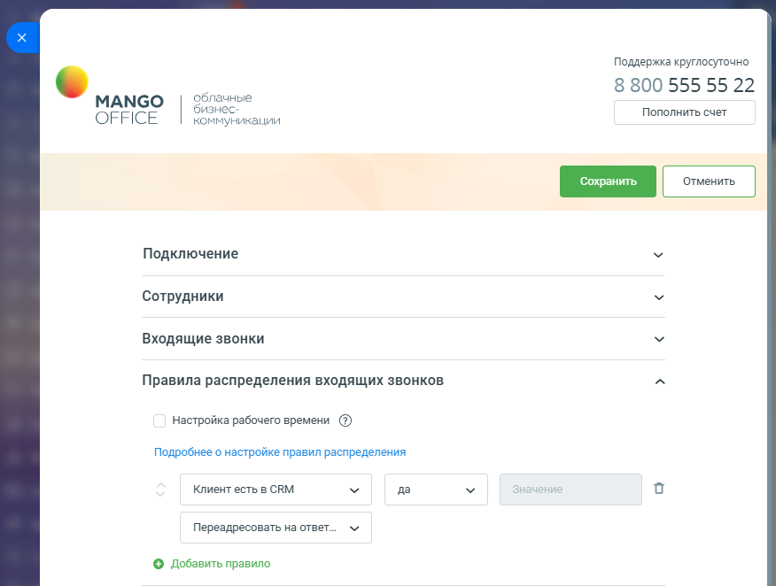
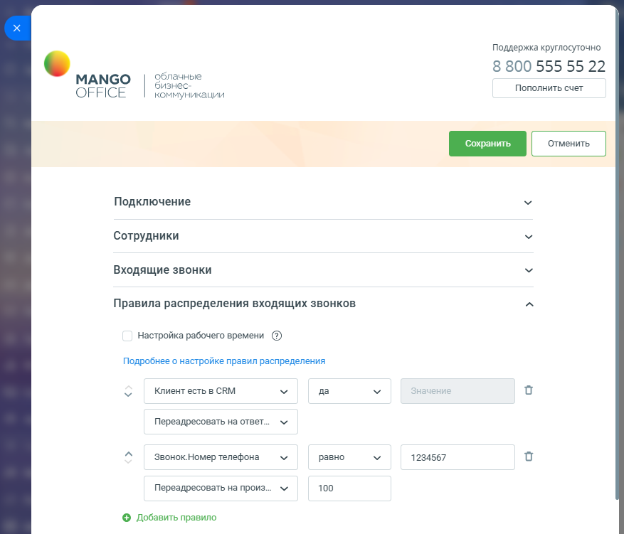
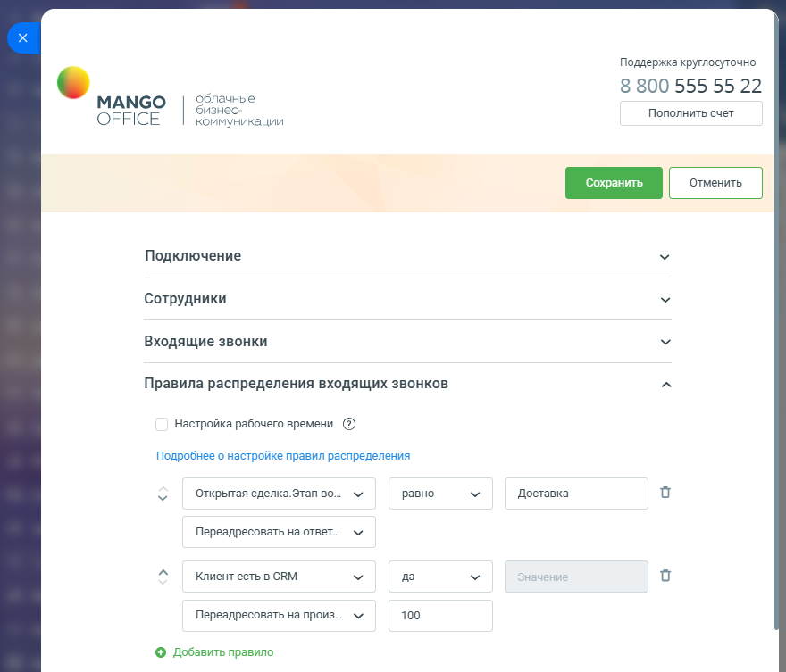
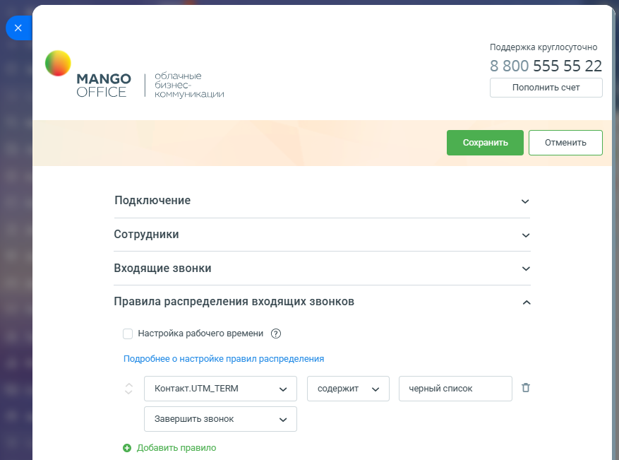
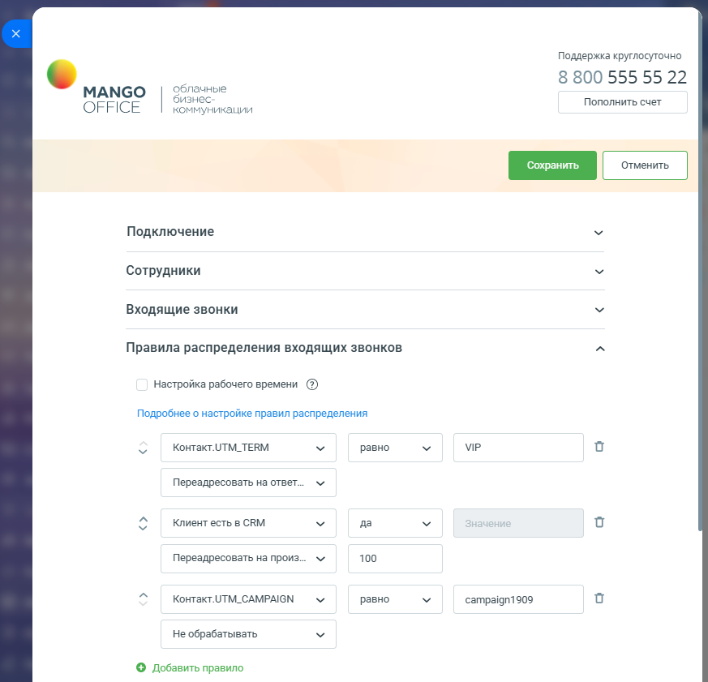

# Примеры настройки правил умного алгоритма распределения

> Трассировка: PDF §2.3 · сквозные стр. 56-61 · источники: ч.1 `kb/sources/integration-bitrix24/Mango_office_integration_Bitrix24.pdf` с.56-61.

Пример 1. Типовой алгоритм распределения - распределение звонков по ответственным менеджерам. При входящем звонке виджет определит Клиента по номеру звонящего и затем определит сотрудника, ответственного за Клиента. После чего распределит звонок на данного сотрудника. А если звонок от нового Клиента, то пустить его далее по схеме переадресации, см. рисунок ниже. Примечание: в Битрикс24 может быть заведено несколько Клиентов с одним и тем же номером телефона. Вызов Клиента будет переведен на сотрудника, указанного в Клиенте, который был создан в CRM раньше всех.

Интеграция Виртуальной АТС MANGO OFFICE и Битрикс24 | Версия от 03.03.2026 Пример 2. Если звонок от существующего Клиента, то автоматически распределить его на ответственного менеджера. Если звонок от нового Клиента, то если звонок поступил на номер А, то адресовать на внутренний номер 100, а если поступил не на номер А, то не обрабатывать и пустить его далее по схеме переадресации.

Интеграция Виртуальной АТС MANGO OFFICE и Битрикс24 | Версия от 03.03.2026 Пример 3. Если звонок от существующего Клиента, то если у Клиента есть сделка на этапе "Доставка", то распределить его на менеджера отдела доставки, внутренний номер 100. Если нет открытых сделок или сделки на других этапах, то распределить на ответственного менеджера. Новых Клиентов - не обрабатывать, пустить далее по схеме переадресации.

Примечание. При такой настройке при входящем звонке система сначала по номеру звонящего ищет компанию/контакт (приоритетнее компания) для определения Клиента. Далее анализируются все открытые сделки, связанные с Клиентом, и, если будет найдена сделка, у которой этап = "Доставка", то первое правило сработает и звонок будет переадресован на номер 100. Интеграция Виртуальной АТС MANGO OFFICE и Битрикс24 | Версия от 03.03.2026 Пример 4. Если вы хотите организовать черный список Клиентов, то пометьте их, к примеру в пользовательском поле Тэги, каким-нибудь значением, к примеру, "черный список" и добавьте строку с проверкой на значение тэга и действием "Завершить":

Интеграция Виртуальной АТС MANGO OFFICE и Битрикс24 | Версия от 03.03.2026 Пример 5. Если звонок от существующего Контакта и, если помечен с меткой VIP, то распределить его на ответственного менеджера, а если не помечен, то адресовать на внутренний номер 100. Если звонок от нового Клиента и, если звонок поступил по рекламной кампании "campaign1909", то адресовать на внутренний номер 100. В остальных случаях не обрабатывать и пустить его далее по схеме переадресации.

Интеграция Виртуальной АТС MANGO OFFICE и Битрикс24 | Версия от 03.03.2026
