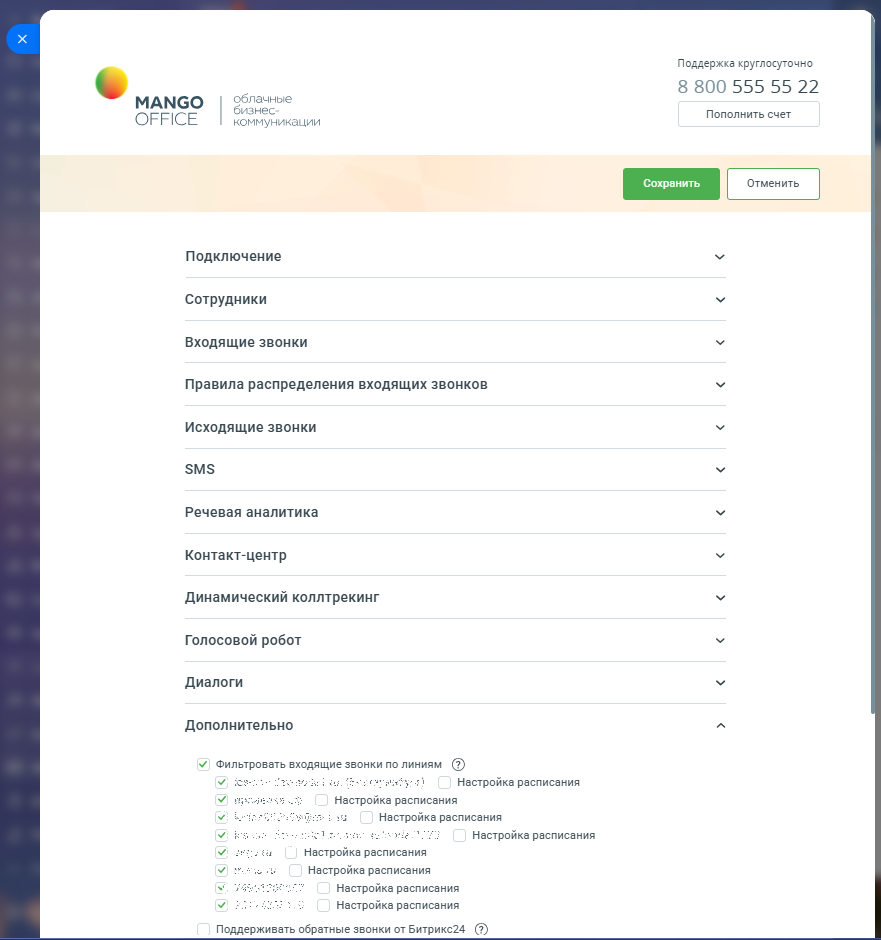

# Фильтровать входящие звонки по линиям

> Трассировка: PDF §2.3 · сквозные стр. 61-63 · источники: ч.1 `kb/sources/integration-bitrix24/Mango_office_integration_Bitrix24.pdf` с.61-63.

Данная функция позволяет в Битрикс24 ограничить обработку звонков, на определенные номера Виртуальной АТС. Например, вы можете исключить звонки на отдельный номер Виртуальной АТС, при этом фиксировать в Битрикс24 звонки только на определенные номера Виртуальной АТС. Обратите внимание, что фильтр входящих звонков по линиям не применяется при обработке исходящих звонков. Примечание. По умолчанию фильтр выключен. Чтобы настраивать фильтр входящих звонков, у вас должен быть подключен расширенный пакет интеграции. Интеграция Виртуальной АТС MANGO OFFICE и Битрикс24 | Версия от 03.03.2026 Чтобы настроить фильтр входящих звонков по линиям, в Битрикс24 необходимо: 1) откройте форму настройки приложения интеграции; 2) откройте блок "Дополнительно"; 3) установите флаг "Фильтровать входящие звонки по линиям" (флаг размещен в группе настроек "Дополнительно"); 4) выберите номера Виртуальной АТС, руководствуясь следующими правилами: Правила учета звонков в CRM: - если поступил звонок на номер ВАТС, отключенный в текущем домене CRM, то звонок не будет учтен в текущем домене CRM; - если поступил звонок на номер ВАТС, подключенный в текущем домене CRM, то звонок обрабатывается согласно текущей логике. 5) нажмите кнопку "Сохранить" в верхней части формы настройки приложения интеграции.

Интеграция Виртуальной АТС MANGO OFFICE и Битрикс24 | Версия от 03.03.2026
