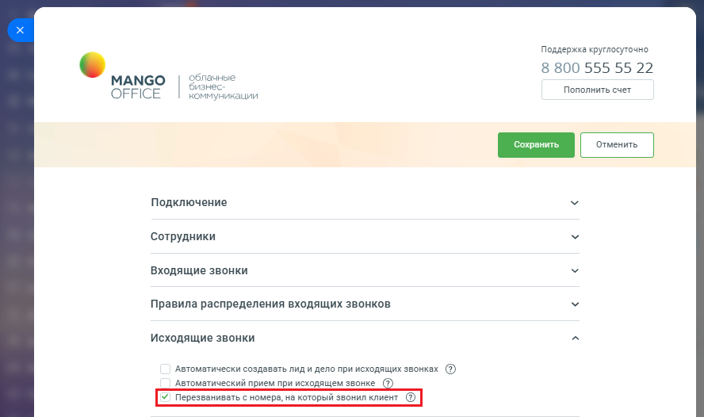

# Как включить настройку

> Трассировка: PDF §2.4 · сквозные стр. 64-65 · источники: ч.1 `kb/sources/integration-bitrix24/Mango_office_integration_Bitrix24.pdf` с.64-65.

Чтобы включить настройку, в Битрикс24 необходимо: 1) откройте форму настройки приложения интеграции; 2) откройте блок "Исходящие звонки"; 3) установите флаг "Перезванивать с номера, на который звони клиент", чтобы включить настройку или снимите данный флаг, чтобы выключить настройку; 4) нажмите кнопку "Сохранить" в верхней части формы настройки приложения интеграции: Интеграция Виртуальной АТС MANGO OFFICE и Битрикс24 | Версия от 03.03.2026

