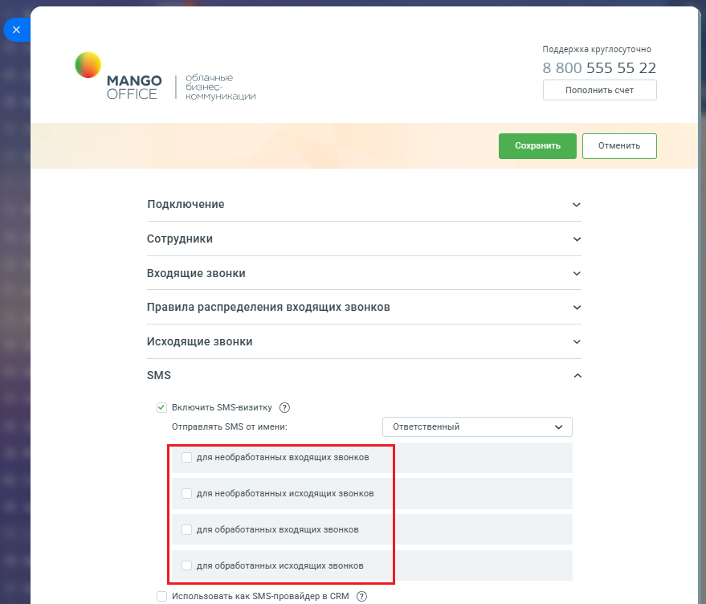
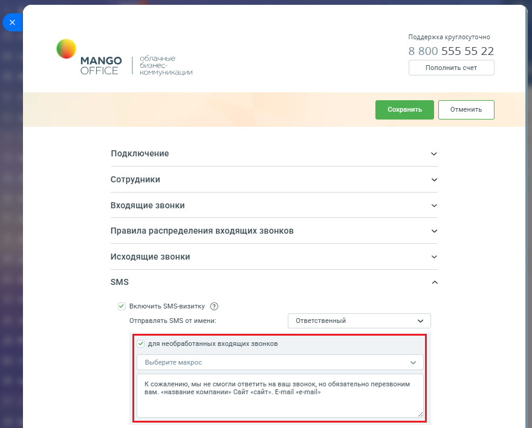

# Как включить и настроить

> Трассировка: PDF §2.5 · сквозные стр. 66-68 · источники: ч.1 `kb/sources/integration-bitrix24/Mango_office_integration_Bitrix24.pdf` с.66-68.

Для настройки SMS визитки в Битрикс24 необходимо: 1) откройте форму настройки приложения интеграции; 2) откройте блок "SMS"; 3) установите флаг "Включить SMS визитку". После этого вы сможете настроить раздельные шаблоны SMS для каждого из четырех случаев: • необработанный входящий звонок от нового Клиента: – “необработанный" звонок - звонок в котором не было разговора сотрудника с Клиентом; – “нового" Клиента - если в результате звонка была автоматически создан лид, согласно настройкам приложения; – SMS высылается после окончания звонка; • необработанный исходящий звонок новому Клиенту: – “необработанный" звонок - звонок в котором не было разговора сотрудника с Клиентом; – “нового" Клиента - если в результате звонка была автоматически создан лид, согласно настройкам приложения; – SMS высылается после окончания звонка; • обработанный входящий звонок от нового Клиента: – “обработанный" звонок - звонок в котором был разговор сотрудника с Клиентом; – “нового" Клиента - если в результате звонка была автоматически создан лид, согласно настройкам приложения; – SMS высылается после окончания звонка; Интеграция Виртуальной АТС MANGO OFFICE и Битрикс24 | Версия от 03.03.2026 • обработанный исходящий звонок новому Клиенту: – “обработанный" звонок - звонок в котором был разговор сотрудника с Клиентом; – “нового" Клиента - если в результате звонка была автоматически создан лид, согласно настройкам приложения; – SMS высылается после окончания звонка. SMS отправляется на номер нового/потенциального Клиента.

При настройке шаблона SMS можно указать: • от какого сотрудника отправляется SMS: – можете указать конкретного сотрудника или указать "Ответственный" и тогда будет автоматически подставляться ответственный; • в текст можно вставить автоматически заполняемые поля из CRM (макросы). В этом случае, приложение перед отправкой SMS будет автоматически заполнять значения. Если значения нет, то подставляться в SMS не будет; Интеграция Виртуальной АТС MANGO OFFICE и Битрикс24 | Версия от 03.03.2026 • список поддерживаемых макросов приведен в выпадающем списке "Макросы". Выберите макрос из списка – он автоматически добавится в конец шаблона; • вы можете настроить шаблон и кликнув на "Пример" посмотреть пример отправляемой SMS:

После отправки SMS, в карточке лида автоматически добавится запись о высланном SMS сообщении.
