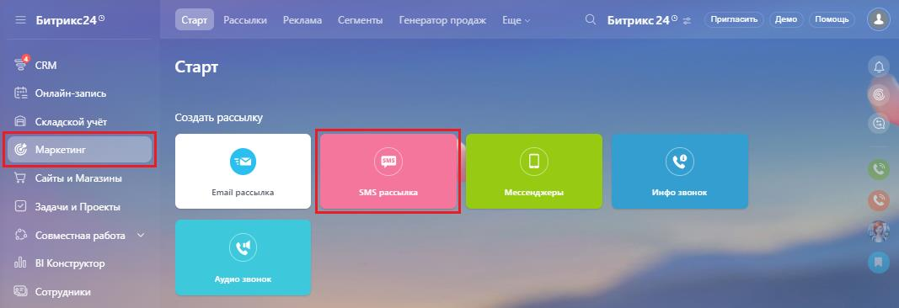
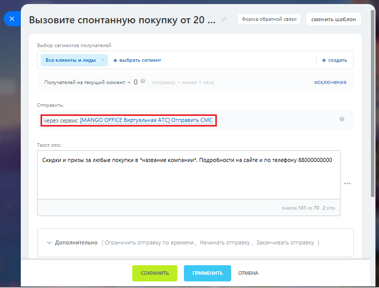
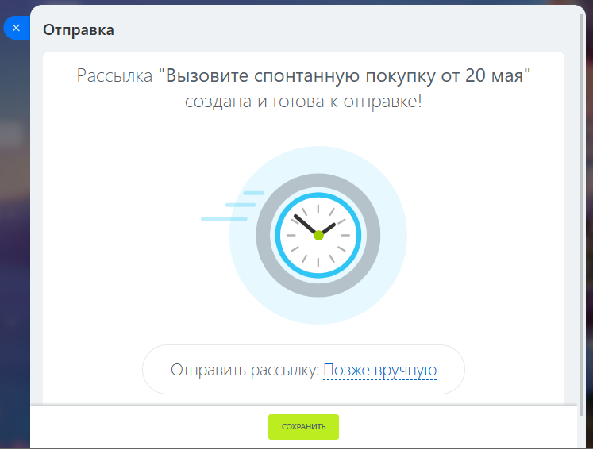
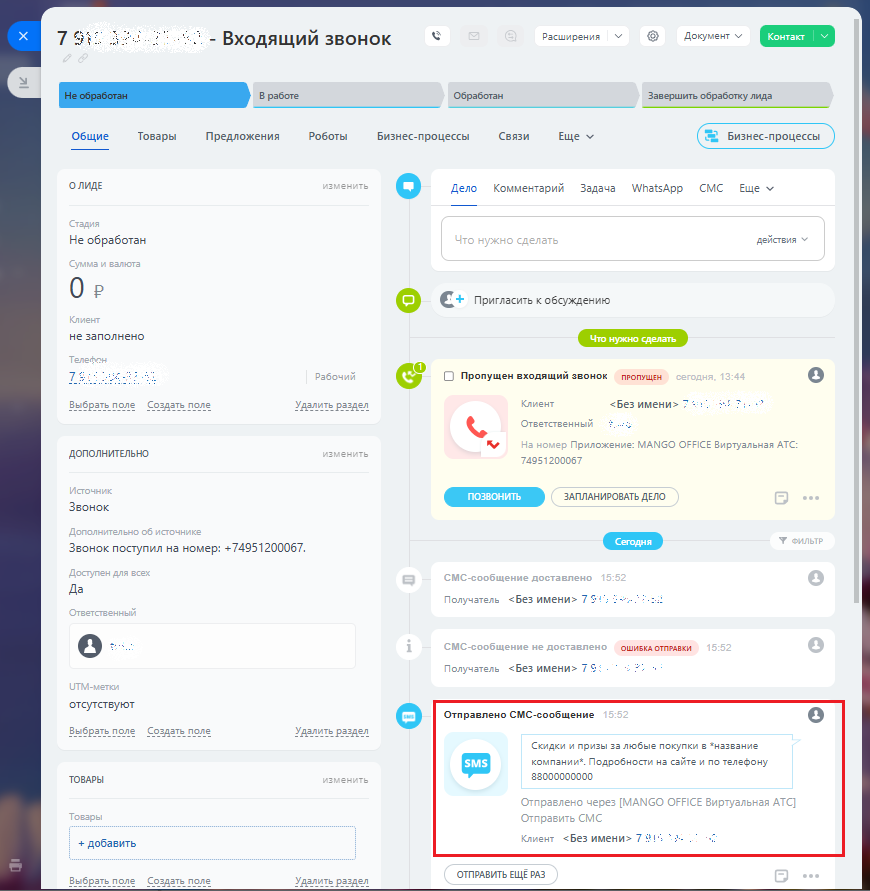

# Как отправить sms-рассылку

> Трассировка: PDF §2.6 · сквозные стр. 71-74 · источники: ч.1 `kb/sources/integration-bitrix24/Mango_office_integration_Bitrix24.pdf` с.71-74.

Чтобы сделать рассылку, в Битрикс24 следует: 1) выберите "Маркетинг"; 2) выберите "SMS-рассылка":

Интеграция Виртуальной АТС MANGO OFFICE и Битрикс24 | Версия от 03.03.2026 3) выберите шаблон рассылки или создайте новый:

4) при настройке рассылки выберите приложение MANGO OFFICE для отправки SMS:

Интеграция Виртуальной АТС MANGO OFFICE и Битрикс24 | Версия от 03.03.2026 5) настройте остальные параметры рассылки, выберите список Клиентов для рассылки. Сохраните настройки и выберите расписание для отправки:

После отправки SMS, информация сохранится в карточке:

Интеграция Виртуальной АТС MANGO OFFICE и Битрикс24 | Версия от 03.03.2026
