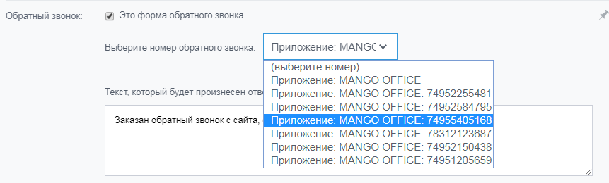

# Как это работает

> Трассировка: PDF §2.9 · сквозные стр. 79 · источники: ч.1 `kb/sources/integration-bitrix24/Mango_office_integration_Bitrix24.pdf` с.79.

Важно! Настройка доступна только для расширенного пакета интеграции. С помощью приложения интеграции MANGO OFFICE можно обрабатывать заказы звонков через формы обратного звонка Битрикс24. Для этого нужно включить флаг "Поддерживать обратные звонки от Битрикс24" в форме настроек приложения. При заказе обратного звонка со стороны Клиента, приложение автоматически звонит указанному в настройках сотруднику, либо группе сотрудников. Если посетитель сайта оставит заявку, то сначала приложение интеграции позвонит сотруднику / группе сотрудников, а затем Клиенту на оставленный им номер, через выбранную линию Виртуальной АТС. В зависимости от настроек, в Битрикс24 автоматически будет создана сделка/контакт/лид. В истории звонок сохранится как исходящий звонок от сотрудника к Клиенту. После того как вы включите функцию поддержки обратных звонков от Битрикс24, вы сможете выбрать приложение интеграции MANGO OFFICE в настройках формы обратного звонка Битрикс24:

