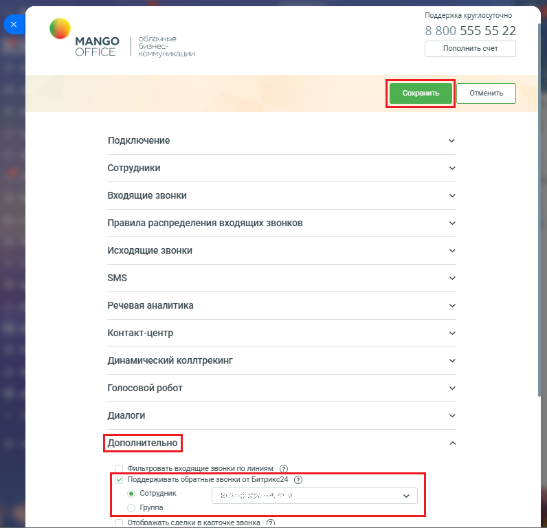

# Как включить или выключить поддержку обратных звонков

> Трассировка: PDF §2.9 · сквозные стр. 80-81 · источники: ч.1 `kb/sources/integration-bitrix24/Mango_office_integration_Bitrix24.pdf` с.80-81.

Для этого, выполните следующие действия: 1) откройте форму настройки приложения; 2) нажмите на пункт "Дополнительно"; 3) установите флаг "Поддерживать обратные звонки от Битрикс24"; 4) выберите сотрудника или группу сотрудников, который (-ая) будет обрабатывать заказы обратного звонка (общаться с Клиентом); 5) нажмите кнопку "Сохранить" в верхней части формы настройки приложения интеграции:

Интеграция Виртуальной АТС MANGO OFFICE и Битрикс24 | Версия от 03.03.2026
