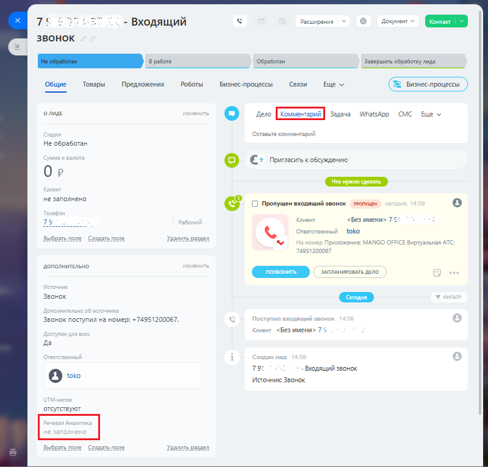

# Как посмотреть тематику разговора

> Трассировка: PDF §2.10 · сквозные стр. 84 · источники: ч.1 `kb/sources/integration-bitrix24/Mango_office_integration_Bitrix24.pdf` с.84.

Чтобы вывести на экран название тематики, определенной в том или ином лиде, для этого в Битрикс24 следует: 1) открыть лид; 2) посмотреть название тематики в поле "Речевая аналитика" и поле "Комментарий".

