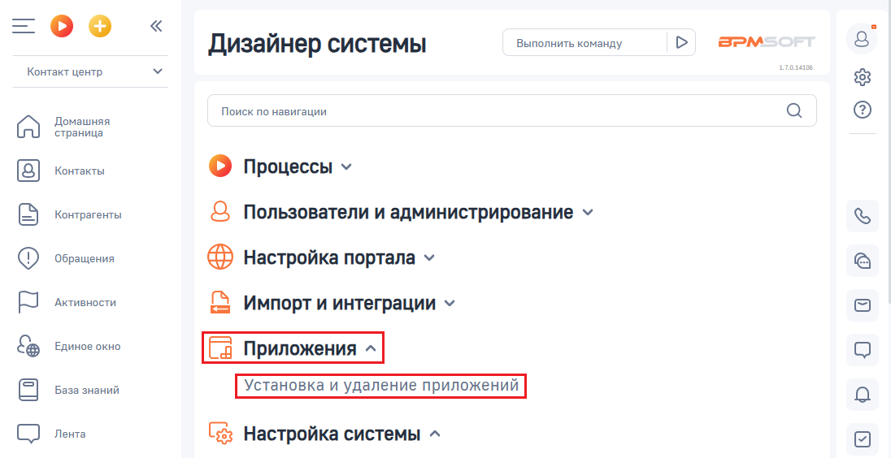
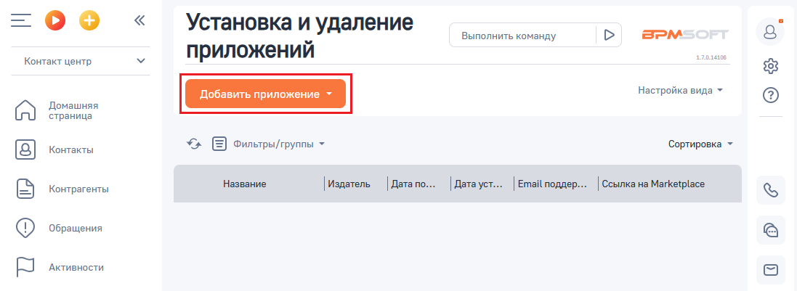
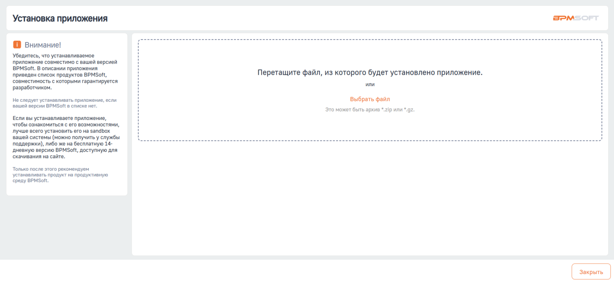

# Установка приложения

> Трассировка: PDF §1 · сквозные стр. 7-9 · источники: ч.1 `kb/sources/integration-bpmsoft/Mango_office_integration_BPMSoft.pdf` с.7-9.

Чтобы установить приложение интеграции, необходимо: 1) открыть ваш BPMSoft; Примечание. Для входа в BPMSoft вам потребуются ссылка на BPMSoft, а также логин и пароль пользователя BPMSoft. Необходимые данные вы можете узнать у своего администратора.

2) нажать на кнопку ; 3) выбрать пункт “Открыть дизайнер системы”:

4) открывшуюся страницу дизайнера системы прокрутить вниз так, чтобы был виден блок “Приложения”. В этом блоке нажать на ссылку “Установка и удаление приложений”:

Руководство по интеграции АТС MANGO OFFICE и BPMSoft | Версия от 22.06.2026 5) нажать на кнопку “Добавить приложение”:

6) выбрать пункт “Установить из файла”:

7) нажать на кнопку “Выбрать файл”:

Руководство по интеграции АТС MANGO OFFICE и BPMSoft | Версия от 22.06.2026 8) в открывшемся окне программы “Проводник” (если вы работаете под Windows) нужно указать архив (соответствующий Вашей редакции BPMSoft), в котором содержатся файлы приложения интеграции, затем нажать кнопку “Продолжить”. Будет выполнена загрузка приложения из архива и отображено соответствующее сообщение. 9) после завершения загрузки, автоматически начнется установка приложения. Вам нужно дождаться окончания установки приложения, при этом нельзя выходить из системы, закрывать окно браузера. Примечание. Установка приложение интеграции может занять до 10 минут. 10) после завершения установки приложения проверьте, что не выдано сообщение об ошибке. После получения сообщения об успешной установке приложения, нужно выполнить установку системных настроек, описанных далее.
