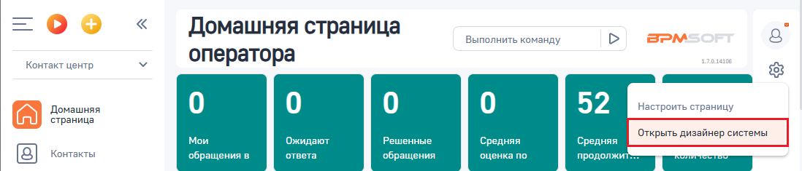
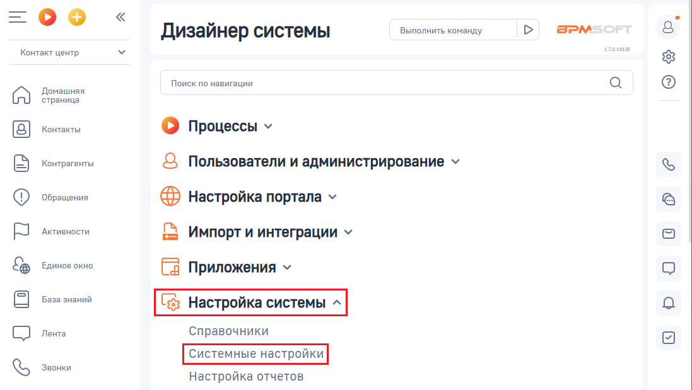
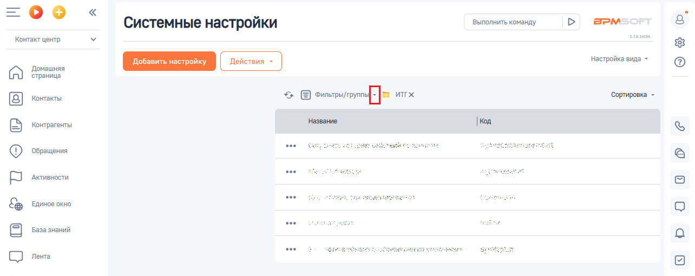
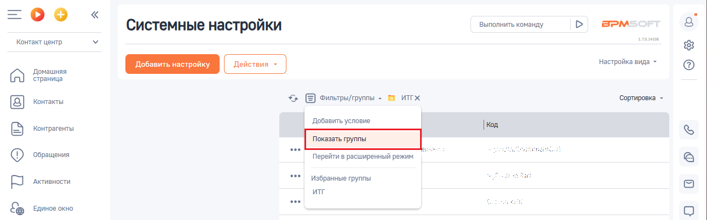
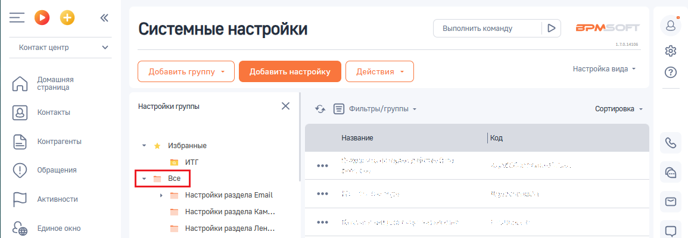
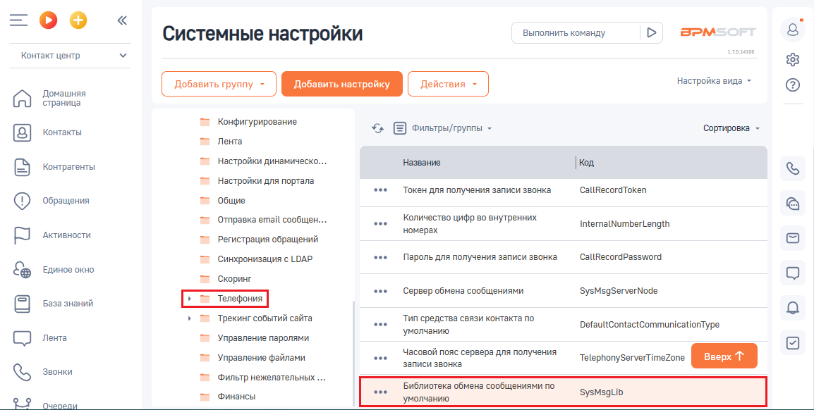
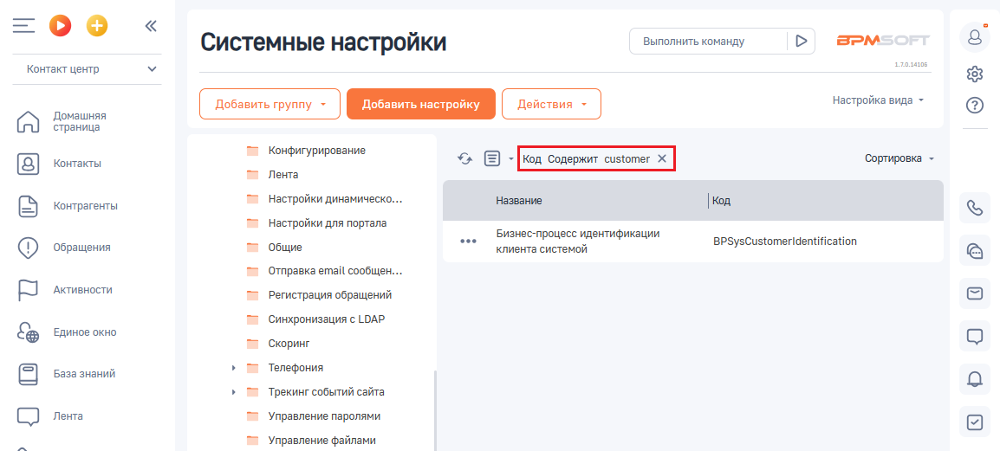
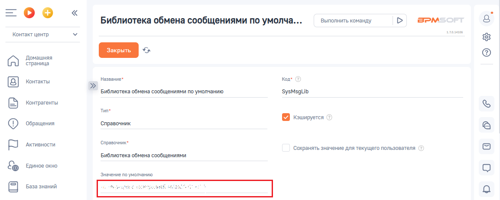
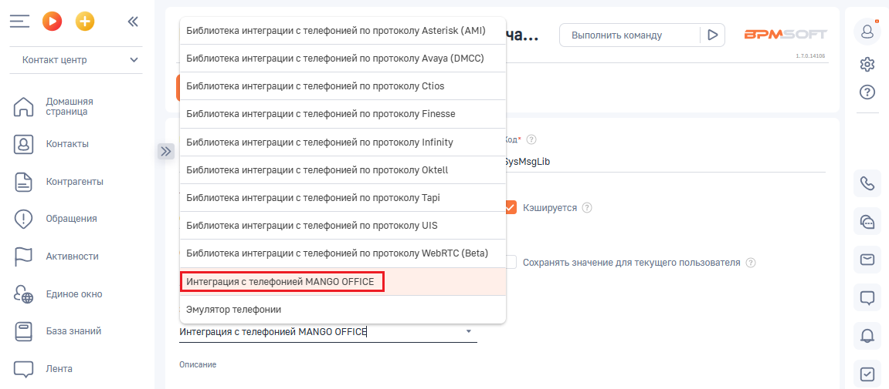
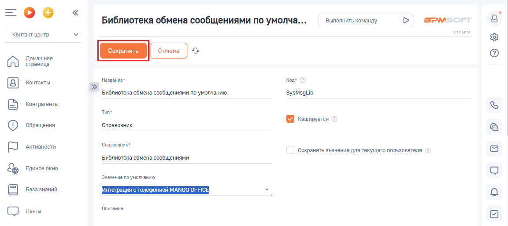

# Установка системных настроек

> Трассировка: PDF §1 · сквозные стр. 9-13 · источники: ч.1 `kb/sources/integration-bpmsoft/Mango_office_integration_BPMSoft.pdf` с.9-13.

В вашем BPMSoft выполните следующие действия: 1) нажмите BPMSoft; Примечание. Для входа в BPMSoft вам потребуются - ссылка на BPMSoft, а также логин и пароль пользователя BPMSoft. Необходимые данные вы можете узнать у своего администратора.

2) нажмите на кнопку ; 3) выберите пункт “Открыть дизайнер системы”:

4) открывшуюся страницу дизайнера системы прокрутите вниз до блока “Настройка системы”. В этом блоке нажмите на ссылку “Системные настройки”;

Руководство по интеграции АТС MANGO OFFICE и BPMSoft | Версия от 22.06.2026

5) нажмите на значок :

6. выберите пункт “Показать группы”:

7. прокрутите список “Все” вниз до пункта “Телефония”:

Руководство по интеграции АТС MANGO OFFICE и BPMSoft | Версия от 22.06.2026 8. нажмите на пункт “Телефония”. Будет открыт список параметров; 9. дважды нажмите на строку “Библиотека обмена сообщениями по умолчанию”:

Важно! Если в списке параметров нет строки “Библиотека обмена сообщениями по умолчанию”, то возможно у вас настроен фильтр, который

отображается над списком параметров. Отключите фильтр, нажав кнопку . После этого будет отображен полный список параметров.

Руководство по интеграции АТС MANGO OFFICE и BPMSoft | Версия от 22.06.2026 10. нажмите на строку “Значение по умолчанию”. Будет показан раскрывающийся список;

12. выберите пункт “Интеграция с телефонией MANGO OFFICE”; Примечание. Если в списке “Значение по умолчанию” нет пункта “Интеграция с телефонией MANGO OFFICE”, значит приложение не установлено. Попробуйте повторно установить приложение по этой инструкции.

13. нажмите на кнопку “Сохранить”:

Далее, вам следует переходить к настройкам интеграции в Личном кабинете MANGO OFFICE. Руководство по интеграции АТС MANGO OFFICE и BPMSoft | Версия от 22.06.2026
