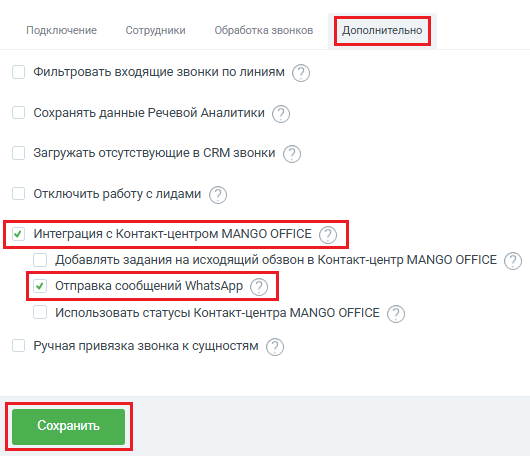

# Как включить отправку сообщений WhatsApp

> Трассировка: PDF §2.8 · сквозные стр. 74-75 · источники: ч.1 `kb/sources/integration-bpmsoft/Mango_office_integration_BPMSoft.pdf` с.74-75.

Для этого, в окне “Основные настройки интеграции” следует: 1) открыть закладку “Дополнительно”; 2) активировать переключатель “Интеграция с Контакт-центром MANGO OFFICE”; 3) активировать переключатель “Отправка сообщений WhatsApp”; 4) нажмите кнопку “Сохранить”:

Руководство по интеграции АТС MANGO OFFICE и BPMSoft | Версия от 22.06.2026
