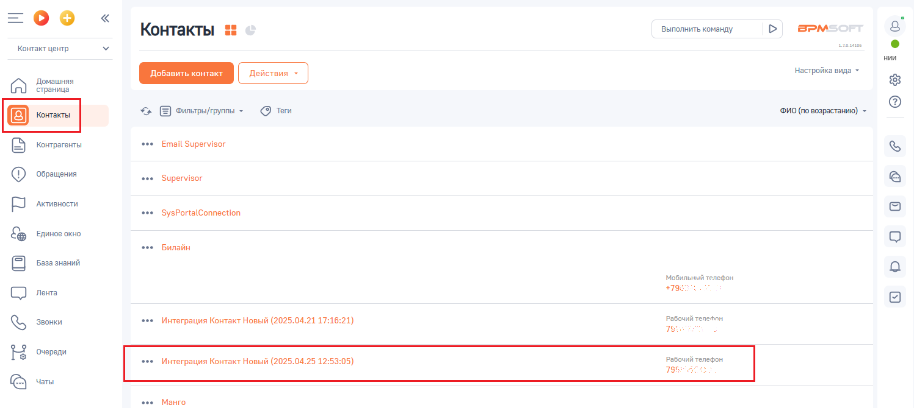
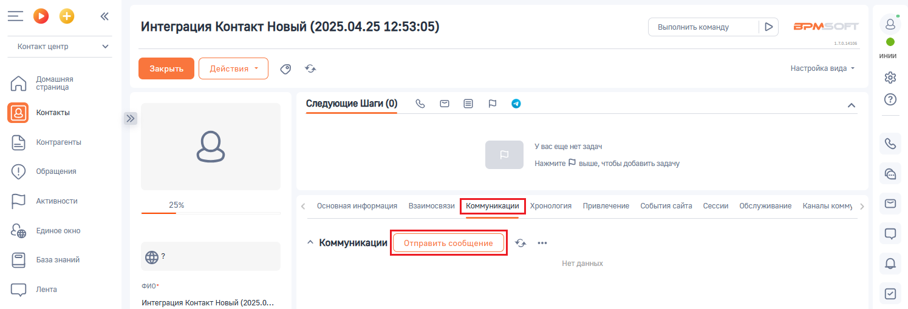
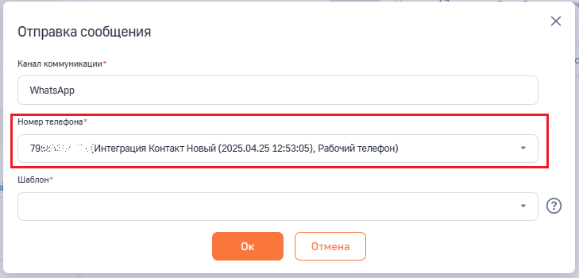
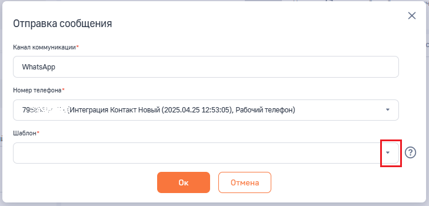
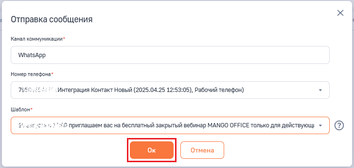
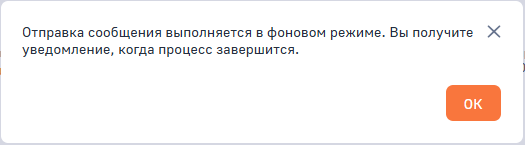
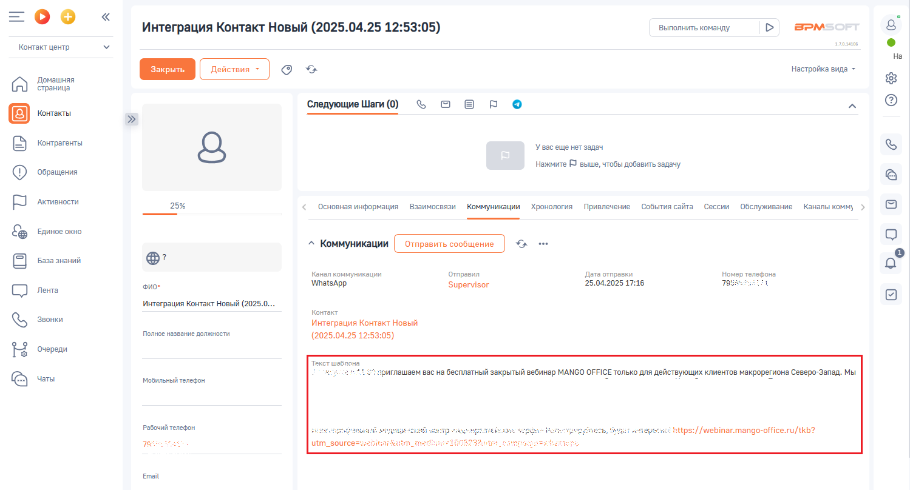

# Как отправить Клиенту сообщение WhatsApp

> Трассировка: PDF §2.8 · сквозные стр. 75-77 · источники: ч.1 `kb/sources/integration-bpmsoft/Mango_office_integration_BPMSoft.pdf` с.75-77.

Для этого в вашей BPMSoft следует: 1) отфильтруйте записи в разделе “Контакты” или “Контрагенты” так, чтобы найти запись о Клиенте, которому хотите отправить HSM-сообщение; 2) нажмите на строку с данными контакта, которому хотите отправить HSM- сообщение. Будет открыта карточка контакта;

3) откройте закладку “Коммуникации”; 4) нажмите на кнопку “Отправить сообщение”:

6) вы можете выбрать номер телефона Клиента, на который будет отправлено hsm-сообщение, если у клиента несколько номеров телефонов: Руководство по интеграции АТС MANGO OFFICE и BPMSoft | Версия от 22.06.2026

7) в поле “Шаблон“ нажмите на кнопку “Стрелка” , чтобы выбрать шаблон hsm-сообщения:

8) выберите шаблон hsm-сообщения: 9) нажмите на кнопку “Ок”:

10) будет запущено процесс отправки hsm-сообщения и выдано соответствующее сообщение, в котором нажмите кнопку “Ок”:

Руководство по интеграции АТС MANGO OFFICE и BPMSoft | Версия от 22.06.2026 11) после того, как сообщение будет отправлено, в вашем BPMSoft будет отображено уведомление, а также в разделе “Коммуникации” будет отображена информация об отправленном сообщении:

