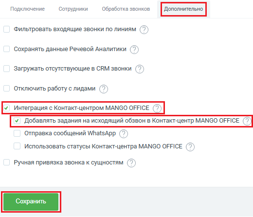

# Как включить настройку

> Трассировка: PDF §2.9 · сквозные стр. 78 · источники: ч.1 `kb/sources/integration-bpmsoft/Mango_office_integration_BPMSoft.pdf` с.78.

Для этого, в окне “Основные настройки интеграции” следует: 1) откройте закладку “Дополнительно”; 2) активируйте переключатель “Интеграция с Контакт-центром MANGO OFFCIE”; 3) активируйте переключатель “Добавлять задания на исходящий обзвон в Контакт-центр MANGO OFFCIE”; 4) нажмите кнопку “Сохранить”.

