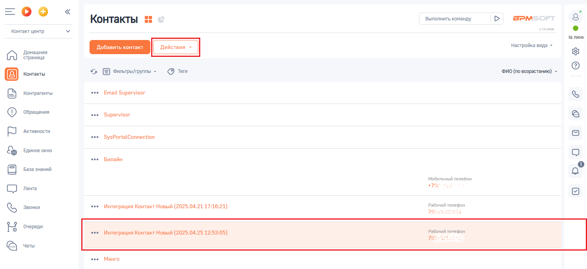
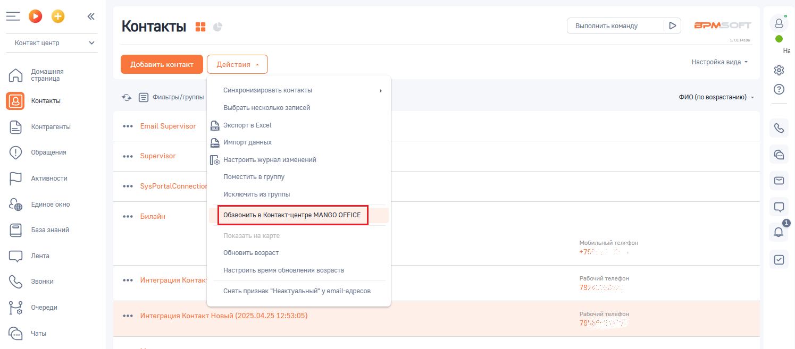
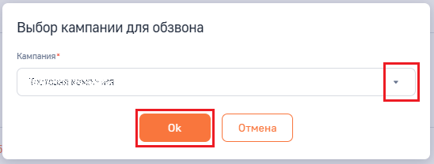
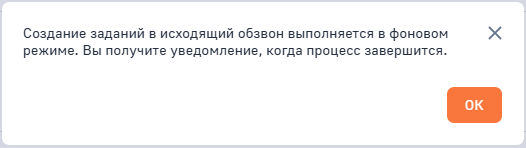
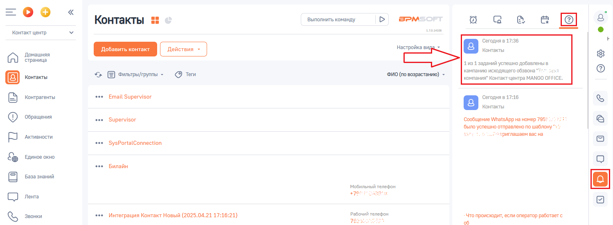

# Как добавить задание в кампанию исходящего обзвона Контакт-центра MANGO OFFICE

> Трассировка: PDF §2.9 · сквозные стр. 78-81 · источники: ч.1 `kb/sources/integration-bpmsoft/Mango_office_integration_BPMSoft.pdf` с.78-81.

MANGO OFFICE Чтобы добавлять номера телефонов в кампанию ИО Контакт-центра MANGO OFFICE, следует: 1) войдите в ваш BPMSoft; 2) отфильтруйте записи в нужном вам разделе, так чтобы найти нужную вам запись: Контакты, Контрагенты; 3) нажмите на строку с данными контакта, который хотите добавить в кампанию ИО; 4) нажмите на кнопку “Действия”: Руководство по интеграции АТС MANGO OFFICE и BPMSoft | Версия от 22.06.2026

5) нажмите на пункт “Обзвонить в Контакт-центре MANGO OFFICE”;

6) выберите название кампании ИО, в которую хотите добавить запись; 7) нажмите на кнопку “Ок”:

Руководство по интеграции АТС MANGO OFFICE и BPMSoft | Версия от 22.06.2026 8) будет запущено создание заданий в исходящий обзвон в фоновом режиме и выдано соответствующее сообщение, в котором нажмите кнопку “Ок”:

9) после того, как задание будет добавлено в кампанию ИО Контакт-центре MANGO OFFICE, в вашем BPMSoft будет отображено уведомление:

Руководство по интеграции АТС MANGO OFFICE и BPMSoft | Версия от 22.06.2026
