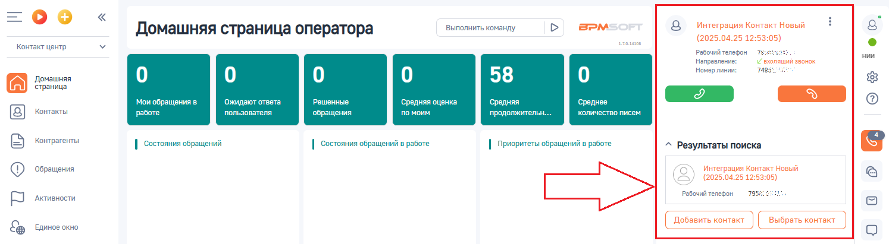
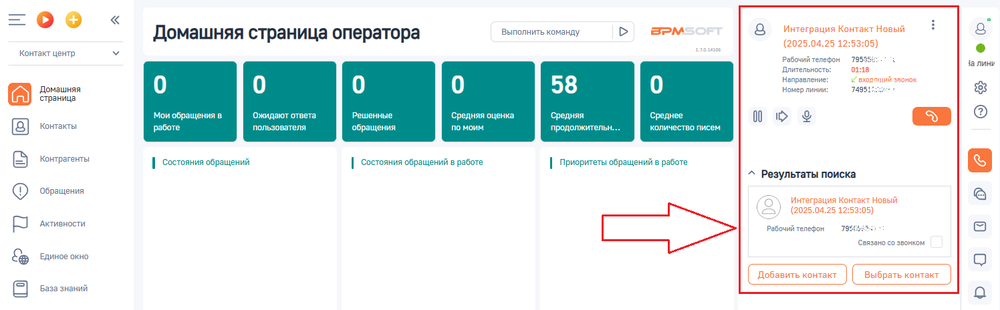
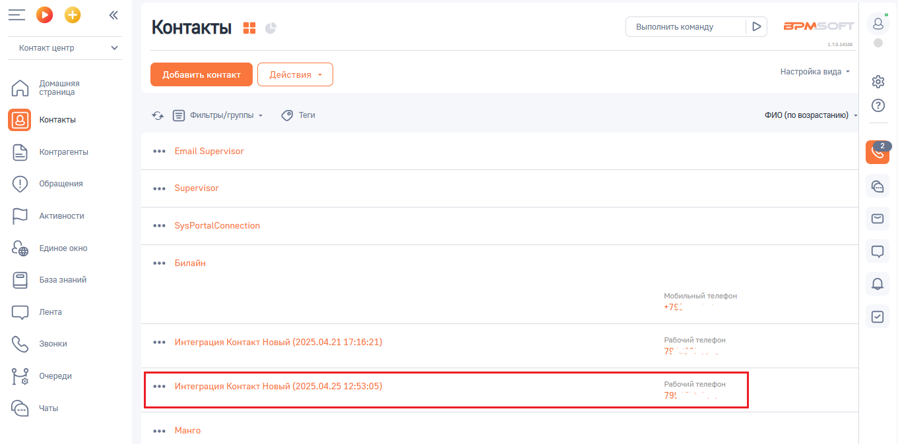

# 3.1. Входящий звонок

> Трассировка: PDF §3.1 · сквозные стр. 81-82 · источники: ч.1 `kb/sources/integration-bpmsoft/Mango_office_integration_BPMSoft.pdf` с.81-82.

При входящем звонке у сотрудника зазвонит телефон (указанный в карточке сотрудника в Личном кабинете в качестве средства приема вызовов). А также, в BPMSoft будет показано всплывающее уведомление о входящем вызове.

Если сотрудник примет вызов, то карточка звонка будет иметь вид:

Руководство по интеграции АТС MANGO OFFICE и BPMSoft | Версия от 22.06.2026 Если ранее была включена настройка создавать контакт/контрагента/лид при входящем звонке, то в BPMSoft будет создан контакт/контрагента/лид:

Чтобы принять звонок, нужно поднять трубку рабочего телефона или принять звонок в вашем MTalker софтфоне. Чтобы завершить звонок, нужно положить трубку рабочего телефона или

нажать кнопку в карточке звонка.
