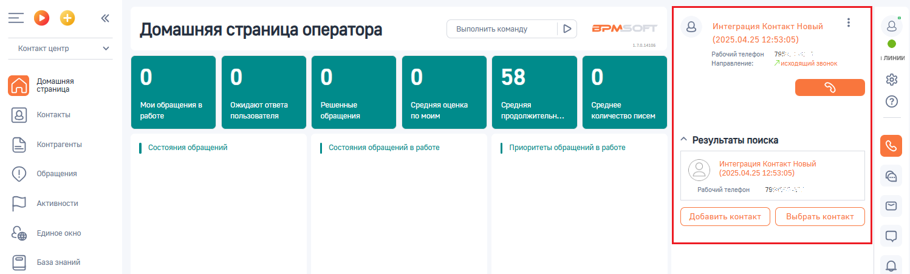

# 3.2. Исходящий звонок

> Трассировка: PDF §3.2 · сквозные стр. 82-83 · источники: ч.1 `kb/sources/integration-bpmsoft/Mango_office_integration_BPMSoft.pdf` с.82-83.

Вы можете инициировать исходящий звонок, кликнув по номеру телефона в интерфейсе BPMSoft или набрать его на своем рабочем телефоне. Например, по клику по номеру телефона контрагента будет инициирован исходящий звонок этому контрагенту. При этом, если сотрудник кликнул на номер телефона в BPMSoft, то сначала зазвонит его рабочий телефон, и только после того как сотрудник поднимет трубку – начнется звонок на выбранный номер телефона, а также в BPMSoft будет показана карточка исходящего звонка.

Руководство по интеграции АТС MANGO OFFICE и BPMSoft | Версия от 22.06.2026
