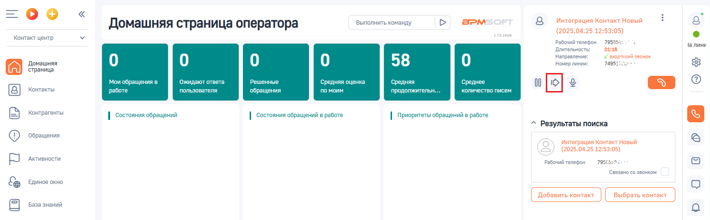
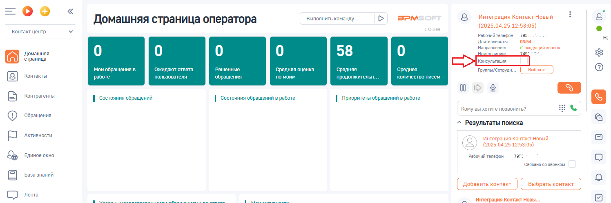
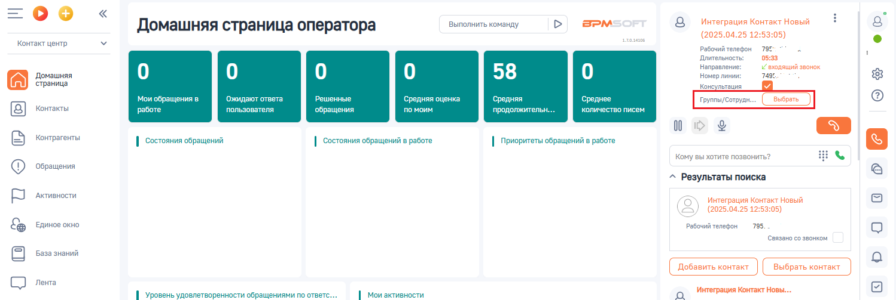
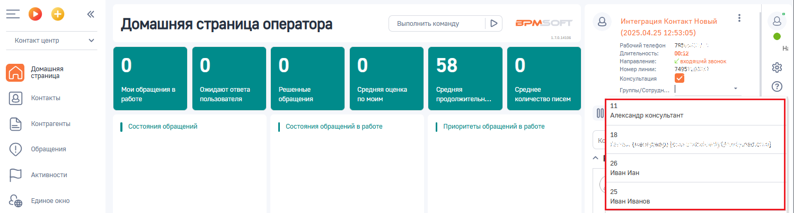
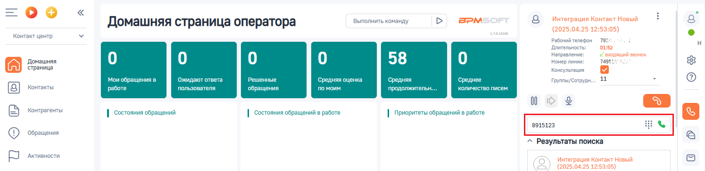
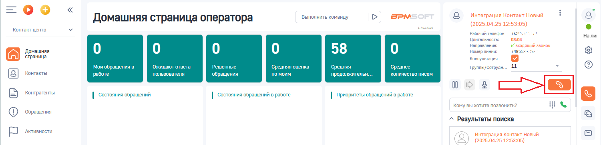

# Как перевести звонок с консультацией

> Трассировка: PDF §3.3 · сквозные стр. 83-86 · источники: ч.1 `kb/sources/integration-bpmsoft/Mango_office_integration_BPMSoft.pdf` с.83-86.

Чтобы перевести звонок с консультацией, в коммутационной панели BPMSoft следует:

1) нажать на кнопку ;

Руководство по интеграции АТС MANGO OFFICE и BPMSoft | Версия от 22.06.2026 2. активировать переключатель “Консультация”;

3. если нужно перевести звонок на сотрудника, которому выдан внутренний номер телефона ВАТС, то надо: • нажать на значение “ВЫБРАТЬ” напротив поля “Группы/Сотрудники”:

• кликните по полю “Группы/Сотрудники”. Появится выпадающий список ваших сотрудников, которые имеют внутренний номер телефона ВАТС и, на которых можно перевести звонок. Вам нужно выбрать номер сотрудника, на которого будет переведен звонок; Примечание. Начните печать номер телефона сотрудника, на которого надо перевести звонок, в поле “Группы/Сотрудники”. Будет показан список сотрудников, соответствующих введенному номеру.

Руководство по интеграции АТС MANGO OFFICE и BPMSoft | Версия от 22.06.2026 4) если нужно перевести звонок на произвольный номер телефона, то надо ввести произвольный номер в поле “Кому вы хотите позвонить”:

5) нажмите на кнопку . Текущий звонок Клиента будет поставлен на удержание и начнется звонок выбранному сотруднику, либо на введенный произвольный номер.

Как только вызываемый абонент снимет трубку, между вами будет установлено соединение. После разговора с абонентом, чтобы перевести звонок на выбранного сотрудника / введенный номер телефона, нужно нажать на ссылку “СОЕДИНИТЬ” в поле “Консультация”. Иначе, если абонент, на которого переводится звонок, не берет трубку или в процессе консультации вопрос был решен без необходимости перевода звонка, то можно отменить перевод. Для этого нужно нажать на ссылку “ВЕРНУТЬСЯ” в поле “Консультация”. Важно. Нажатие кнопки “Отбой” на коммутационной панели не приведет к переводу звонка. Руководство по интеграции АТС MANGO OFFICE и BPMSoft | Версия от 22.06.2026
