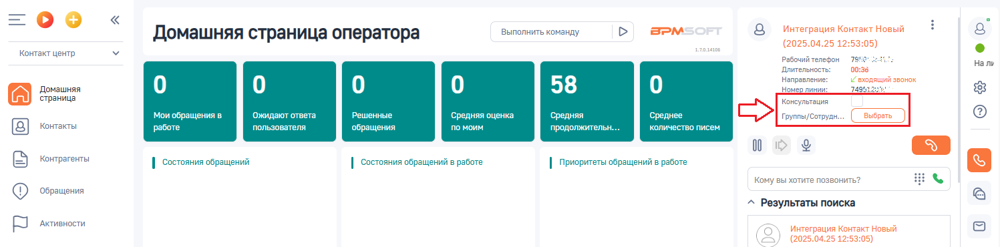
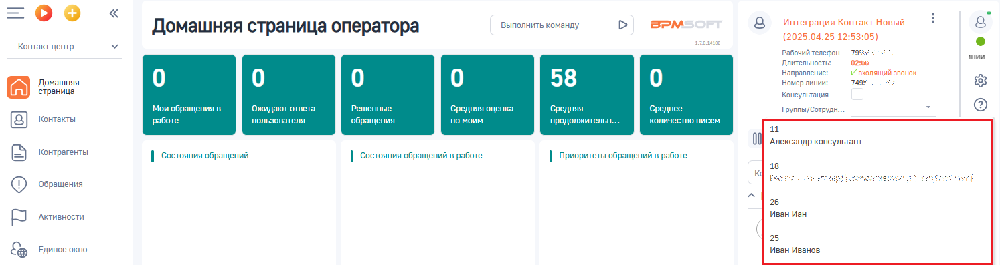
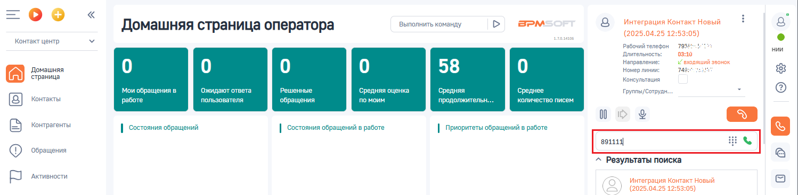
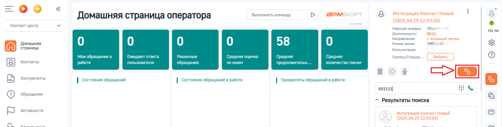

# Слепой перевод или как перевести звонок без консультации

> Трассировка: PDF §3.3 · сквозные стр. 86-88 · источники: ч.1 `kb/sources/integration-bpmsoft/Mango_office_integration_BPMSoft.pdf` с.86-88.

Чтобы выполнить слепой перевод звонка, то есть без предварительной консультации, в коммутационной панели BPMSoft следует:

1. нажать на кнопку ;

2) СНЯТЬ галочку “Консультация”, если она установлена; 3) если нужно перевести звонок на сотрудника, которому выдан внутренний номер телефона ВАТС, то надо: • нажать на значение “ВЫБРАТЬ” напротив поля “Группы/Сотрудники”:

• кликните по полю “Группы/Сотрудники”. Появится выпадающий список ваших сотрудников, которые имеют внутренний номер телефона ВАТС и, на которых можно перевести звонок. Вам нужно выбрать номер сотрудника, на которого будет переведен звонок; Примечание. Начните печать номер телефона сотрудника, на которого надо перевести звонок, в поле “Группы/Сотрудники”. Будет показан список сотрудников, соответствующих введенному номеру.

Руководство по интеграции АТС MANGO OFFICE и BPMSoft | Версия от 22.06.2026 3) если нужно перевести звонок на произвольный номер телефона, то надо ввести произвольный номер в поле “Кому вы хотите позвонить”:

4) нажмите на кнопку , см. рисунок ниже. Звонок немедленно переведется на выбранного сотрудника или введенный произвольный номер. Важно. Нажатие кнопки “Отбой” на коммутационной панели не приведет к переводу звонка.

Руководство по интеграции АТС MANGO OFFICE и BPMSoft | Версия от 22.06.2026
