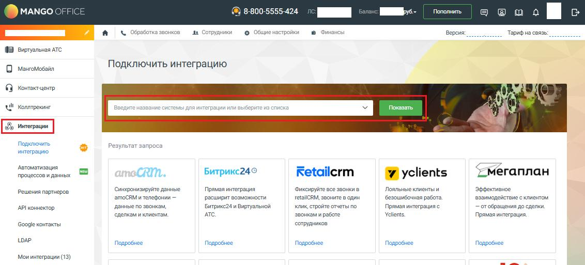
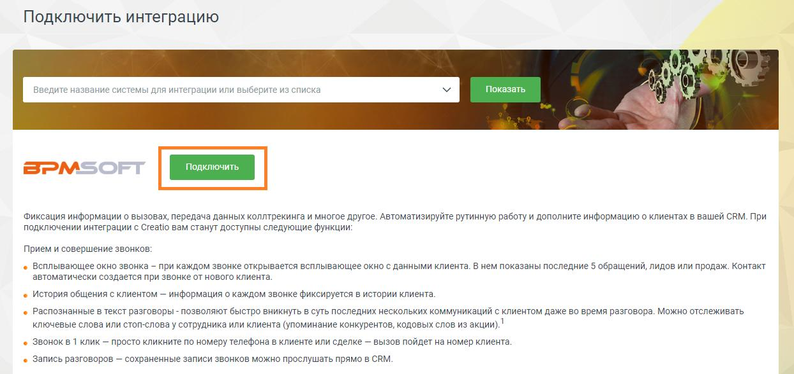
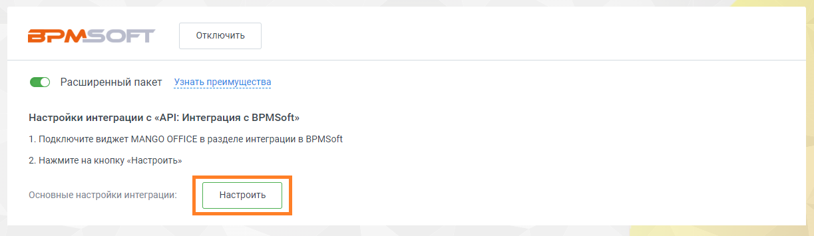

# Установка и базовые настройки

> Трассировка: PDF §1 · сквозные стр. 13-14 · источники: ч.1 `kb/sources/integration-bpmsoft/Mango_office_integration_BPMSoft.pdf` с.13-14.

Для того чтобы подключить приложение интеграции с BPMSoft, нужно выполнить: 1. войдите в ваш Личный кабинет MANGO OFFICE; 2. выберите вашу Виртуальную АТС, если у вас их несколько; 3. перейти в раздел “Интеграции”; 4. выполните одно из действий: – в блоке “BPMSoft” нажмите на кнопку “Подробнее”; – введите название интеграции BPMSoft в поле “Введите название системы для интеграции…” и нажмите кнопку “Показать”:

5. на открывшейся странице “Подключить интеграцию”, нажмите на кнопку “Подключить”;

Руководство по интеграции АТС MANGO OFFICE и BPMSoft | Версия от 22.06.2026 6. в открывшемся всплывающем окне с информацией о подключении нужно указать количество ваших сотрудников, которые будут пользоваться интеграцией с BPMSoft; Примечание. Параметры подключения могут отличаться в зависимости от тарифного плана вашей Виртуальной АТС. 7. нажать на кнопку “Сохранить”. Будет открыта страница “Мои интеграции” в Личном кабинете MANGO OFFICE; 8. нажать на кнопку “Настроить”. Вы перейдете к настройкам подключения к BPMSoft.

