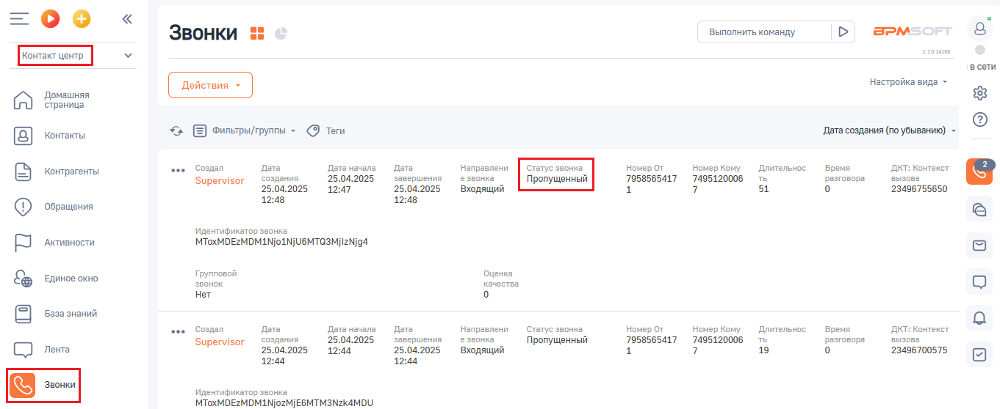

# 4. Пропущенные звонки

> Трассировка: PDF §4 · сквозные стр. 88 · источники: ч.1 `kb/sources/integration-bpmsoft/Mango_office_integration_BPMSoft.pdf` с.88.

Если сотрудник отсутствовал на рабочем месте и были пропущенные звонки, то вне зависимости, был открыт BPMSoft у него или не был открыт, в BPMSoft попадет информация о пропущенных звонках. Чтобы увидеть все пропущенные звонки, необходимо: 1) нажать на пункт “Контакт-центр” в раскрывающемся списке; 2) нажать на пункт “Звонки”. Будет открыта таблица звонков, в которой отображаются все звонки, совершенные через вашу Виртуальную АТС, при этом пропущенным звонкам будет присвоен статус “Пропущенный”. Примечание. Если колонка “Статус звонка” не отображается, то нужно настроить внешний вид таблицы звонков.

