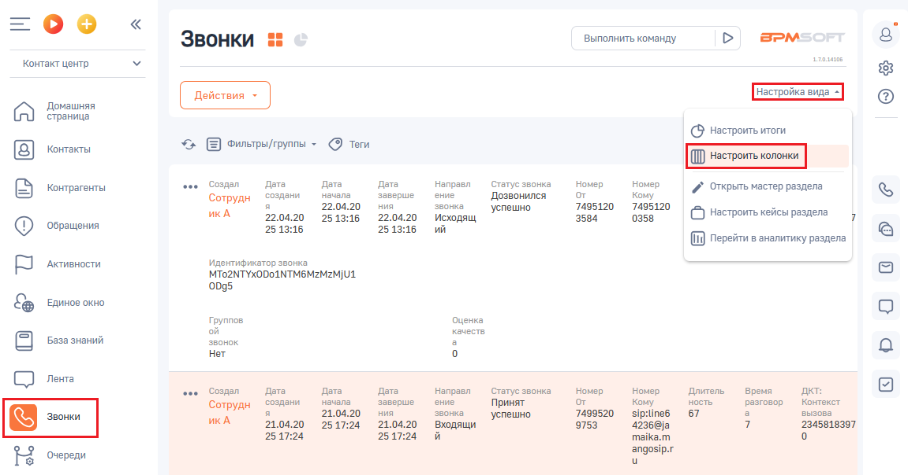
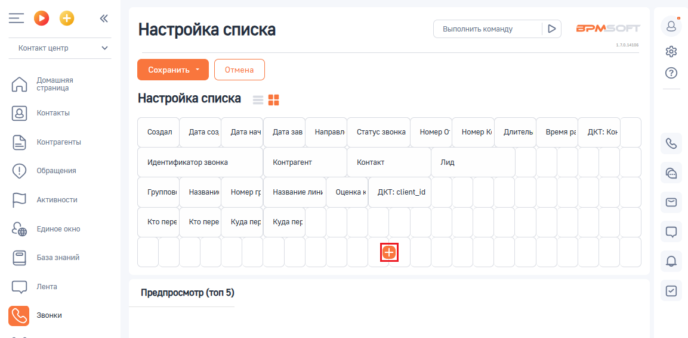
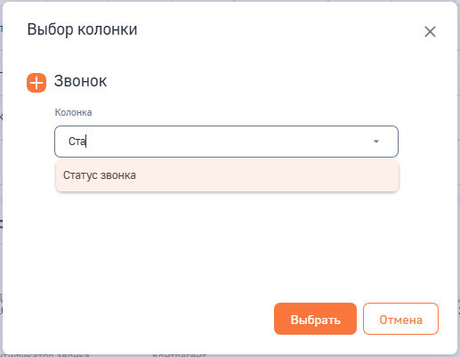
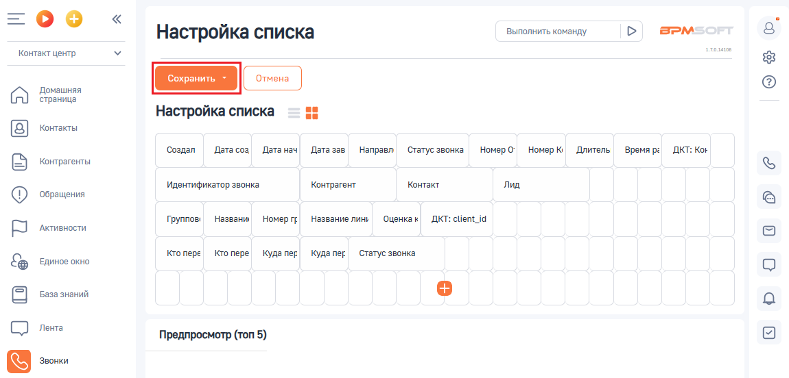

# 4.1. Настройка внешнего вида таблицы звонков

> Трассировка: PDF §4.1 · сквозные стр. 88-91 · источники: ч.1 `kb/sources/integration-bpmsoft/Mango_office_integration_BPMSoft.pdf` с.88-91.

Чтобы настроить внешний вид таблицы звонков, необходимо: 1) нажать на пункт “Контакт-центр” в раскрывающемся списке; 2) нажать на пункт “Звонки”; 3) нажать на ссылку “Настройка вида”; 4) в открывшемся списке выберите пункт “Настроить колонки”: Руководство по интеграции АТС MANGO OFFICE и BPMSoft | Версия от 22.06.2026

4) нажать на кнопку на открывшейся странице “Настройка списка”:

5) в открывшемся окне “Выбор колонки” в поле “Колонка” ввести “Статус звонка”. Будет показан выпадающий список из названий колонок, в котором нужно кликнуть на значение “Статус звонка”; 6) нажать на кнопку “Выбрать”:

Руководство по интеграции АТС MANGO OFFICE и BPMSoft | Версия от 22.06.2026 Будет закрыто окно “Выбор колонки” и снова открыто окно “Настройка списка”, в котором нужно нажать кнопку “Сохранить”:

Руководство по интеграции АТС MANGO OFFICE и BPMSoft | Версия от 22.06.2026
