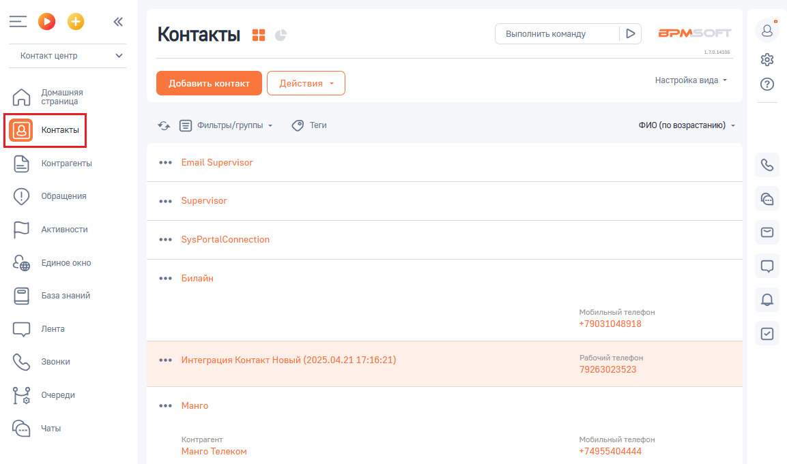
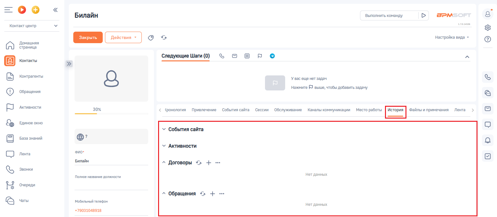

# 5. История вызовов

> Трассировка: PDF §5 · сквозные стр. 91-92 · источники: ч.1 `kb/sources/integration-bpmsoft/Mango_office_integration_BPMSoft.pdf` с.91-92.

Каждый звонок от контакта отображается в истории взаимоотношений с контактом. Чтобы открыть эту историю, необходимо нажать на пункт “Контакты”. Будет открыт список ваших контактов:

Чтобы посмотреть взаимодействия с выбранным контактом дважды нажмите на нужный вам контакт. В открывшейся карточке контакта нажать на вкладку “История”. Будет отображена история взаимодействия с выбранным контактом:

Руководство по интеграции АТС MANGO OFFICE и BPMSoft | Версия от 22.06.2026
