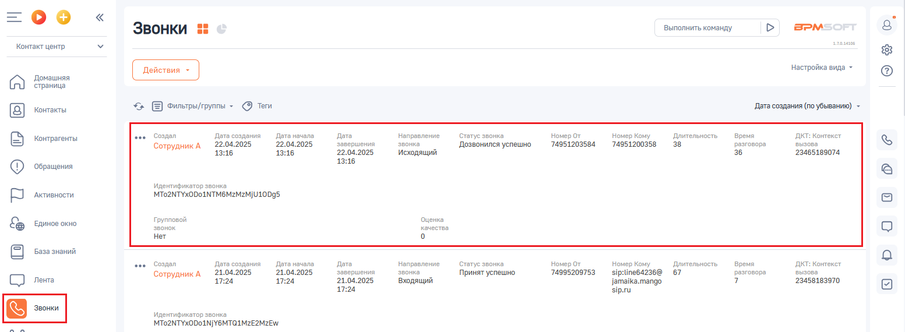
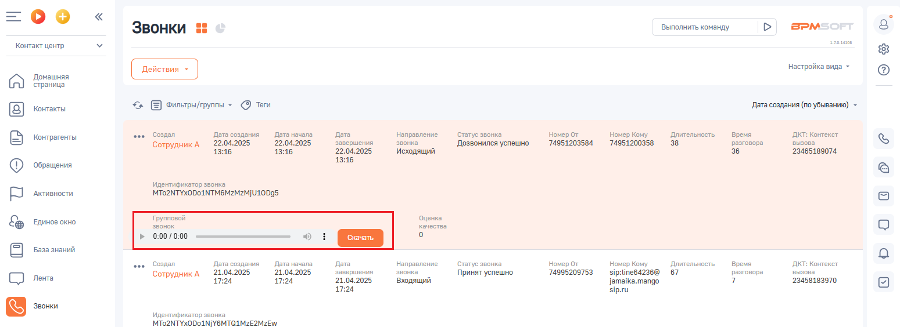

# 6. Запись разговоров

> Трассировка: PDF §6 · сквозные стр. 92-93 · источники: ч.1 `kb/sources/integration-bpmsoft/Mango_office_integration_BPMSoft.pdf` с.92-93.

Если в Виртуальной АТС подключена услуга записи разговоров, то при наличии записи разговора - ее можно прослушать и/или скачать в BPMSoft. Примечания: 1) запись разговора может отобразиться в карточке звонка с небольшой задержкой. 2) если длительность разговора менее 6 сек, то запись разговора не сохранится в Виртуальной АТС и соответственно ссылка на нее не отобразится в BPMSoft. Если в ходе обработки вызова, сотрудники переводили его на других сотрудников, то в BPMSoft будет сохранены все записи разговоров с клиентом с каждым из сотрудников; Чтобы перейти к записи разговора, необходимо: 1. нажать на пункт “Звонки”; 2. нажать на строку с данными разговора. Будут отображены дополнительные элементы интерфейса;

3. кнопки “Открыть”, “Удалить”;

4. чтобы прослушать запись, нужно нажать на кнопку , а чтобы скачать

запись – нажать на кнопку “Скачать” :

Руководство по интеграции АТС MANGO OFFICE и BPMSoft | Версия от 22.06.2026
