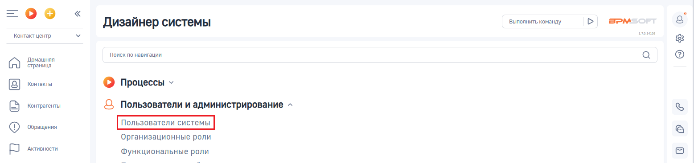
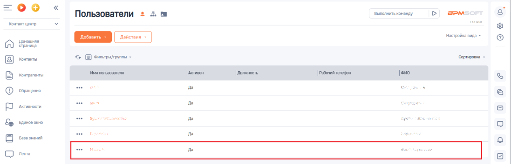
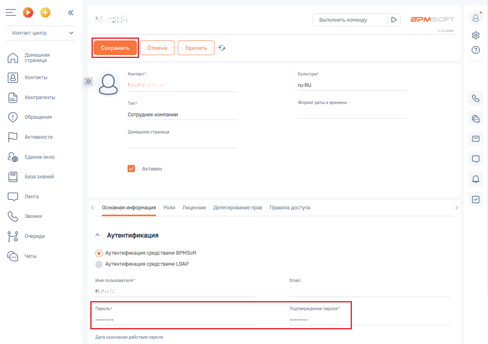

# Как изменить логин и пароль API BPMSoft

> Трассировка: PDF §— · сквозные стр. 93-95 · источники: ч.1 `kb/sources/integration-bpmsoft/Mango_office_integration_BPMSoft.pdf` с.93-95.

Логин и пароль API BPMSoft – это логин и пароль пользователя BPMSoft, который необходим для настройки интеграции в Личном кабинете MANGO OFFICE. Чтобы изменить логин или пароль API BPMSoft, необходимо: 1) войдите в ваш BPMSoft;

2) нажать на кнопку ; 3) выбрать пункт “Открыть дизайнер системы”:

4) на открывшейся странице нажать на ссылку “Пользователи системы”;

5) найдите строку с данными пользователя BPMSoft, чей логин и пароль будет использован для настройки интеграции в Личном кабинете MANGO OFFICE. Примечание. При необходимости используйте фильтры для поиска, нажав на кнопку “Фильтры”. 6. чтобы изменить пароль, дважды нажмите на строку с данными нужного вам пользователя;

Руководство по интеграции АТС MANGO OFFICE и BPMSoft | Версия от 22.06.2026 6) на вкладке “Основная информация” в поле “Имя пользователя” будет указан логин API BPMSoft, а в поле “Пароль” – указан пароль API BPMSoft. 7) При необходимости, изменить пароль API BPMSoft, затем нажмите кнопку “Сохранить”. Данные логин и пароль API BPMSoft нужно использовать для настройки интеграции в Личном кабинете MANGO OFFICE.

Руководство по интеграции АТС MANGO OFFICE и BPMSoft | Версия от 22.06.2026
