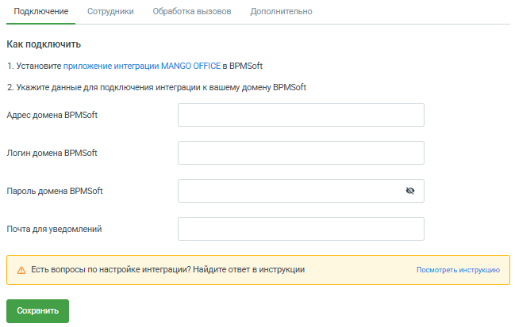
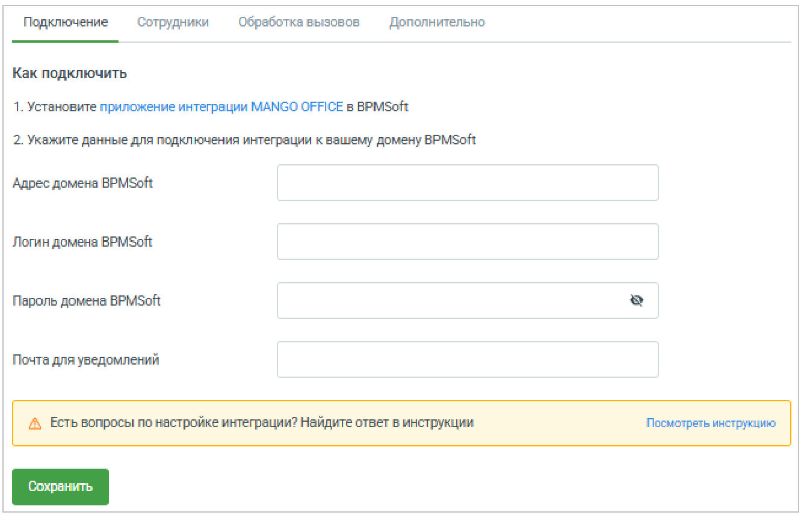

# Настойка подключения к BPMSoft

> Трассировка: PDF §1 · сквозные стр. 14-17 · источники: ч.1 `kb/sources/integration-bpmsoft/Mango_office_integration_BPMSoft.pdf` с.14-17.

Чтобы настроить подключение в форме “Основные настройки интеграции” нужно: 1) открыть вкладку “Подключение”; 2) указать контактный e-mail для получения уведомлений о работе приложения интеграции MANGO OFFICE. Можно указать несколько e- mail через запятую; 3) указать ссылку на вашу BPMSoft. Указывать надо ту же ссылку, что вы указывали, когда выполняли шаг 3 “Подключение приложения интеграции в BPMSoft”; Примечание. Должны выполняться следующие требования к url-адресу: • все символы должны быть в нижнем регистре; • необходимо удалить лишние символы, в том числе пробелы, перед https и после знаков .ru (домена верхнего уровня). Руководство по интеграции АТС MANGO OFFICE и BPMSoft | Версия от 22.06.2026

4) ввести логин и пароль пользователя BPMSoft, при том должны выполняться следующие требования: А) Использовать пользователя Supervisor, а также любого другого пользователя с правами Системного администратора настоятельно не рекомендуется! Б) Необходимо создать в BPMSoft отдельного технического пользователя для интеграции и выдать ему необходимые лицензии в BPMSoft (в том числе лицензии на коннектор MANGO OFFICE). В) Если в BPMSoft выполнена настройка прав на объекты (включено администрирование объектов по операциям, по записям или по колонкам), то необходимо убедиться в том, что у технического пользователя для интеграции имеются полные права на следующие объекты (в том числе, имеются права на уже существующие записи в системе, если включено администрирование по записям): • Звонок (Call) • Контрагент (Account) • Заказ в звонке (ItgCallOrder) • Контакт в звонке (ItgCallContact) • Контрагент в звонке (ItgCallAccount) • Лид в звонке (ItgCallLead) • Обращение в звонке (ItgCallCase) • Продажа в звонке (ItgCallOpportunity) • Проект в звонке (ItgCallProject) • Коммуникация с клиентом (ItgCommuncationMessage) • Отображаемое поле сущности при звонке (MANGO OFFICE) (ItgCallDisplayedField) Руководство по интеграции АТС MANGO OFFICE и BPMSoft | Версия от 22.06.2026 • Настройки связывания полей сущности и звонка (MANGO OFFICE) (ItgCallEntityConnection) • Действиe по звонку (ItgCallActionSettingInCall) • Тег речевой аналитики в звонке (ItgSpeechAnalyticsTagInCall) • Настройка действия по звонку в зависимости от роли (MANGO OFFICE) (ItgCallActionSetting) • Расшифровка записи разговора (речевая аналитика) (ItgSpeechAnalyticsCallTranscript) • Канал коммуникации (ItgCommunicationChannel) • Условия действий при звонке (MANGO OFFICE) (ItgCallActionCondition) • Направление звонка (MANGO OFFICE) (ItgCallActionDirection) • Количество сущностей (MANGO OFFICE) (ItgCallActionEntityCount) • Действие при звонке (MANGO OFFICE) (ItgCallAction) • Счетчик для имени (ItgNameCounter) • Тег речевой аналитики (ItgSpeechAnalyticsTag) • Сущности для конструктора условий (MANGO OFFICE) (ItgCallActionEntities) • Дополнительная информация по сущности (MANGO OFFICE) (ItgCallEntitySecondaryInfo) • Классы цветов отображаемых полей (MANGO OFFICE) (ItgCallFieldColors) • Статус звонка (ItgCallStatus) 5) Нажмите кнопку “ Сохранить ”. - если данные указаны корректно, настройки будут сохранены - если данные указаны неверно, сохранение не будет выполнено. После этого вам станут доступны прочие настройки подключения к BPMSoft: Руководство по интеграции АТС MANGO OFFICE и BPMSoft | Версия от 22.06.2026

В случае ошибки проверьте: • корректность логина и пароля • наличие необходимых прав у пользователя • подключено ли приложение интеграции в BPMSoft
