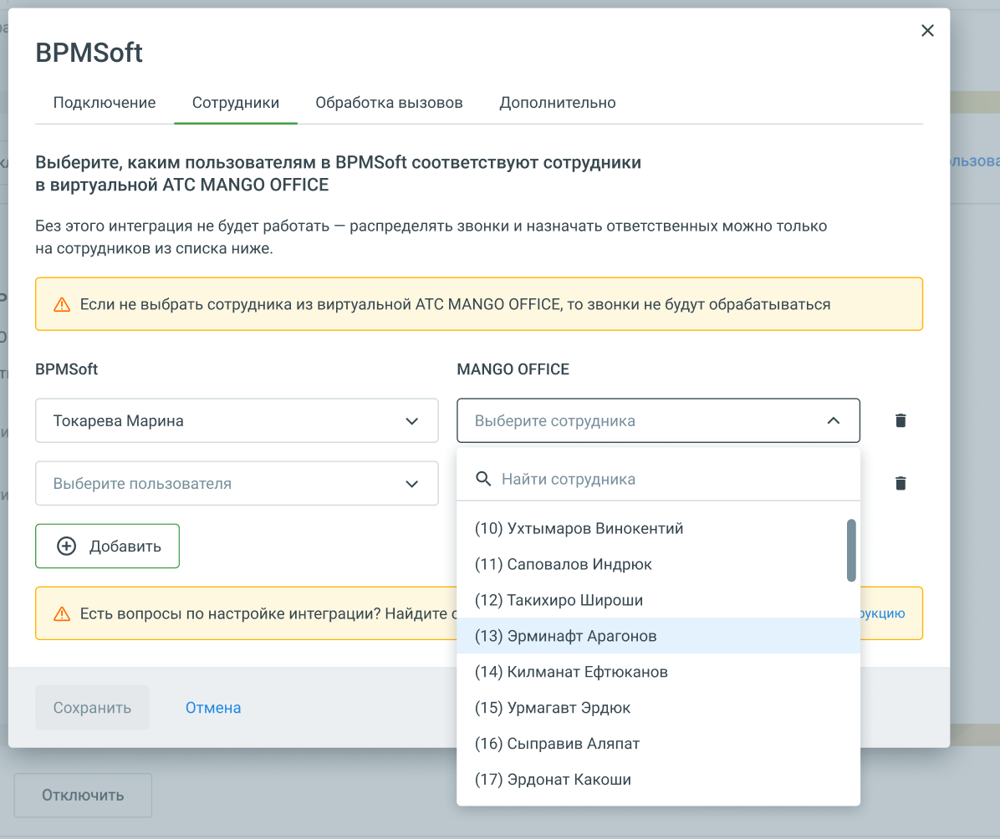
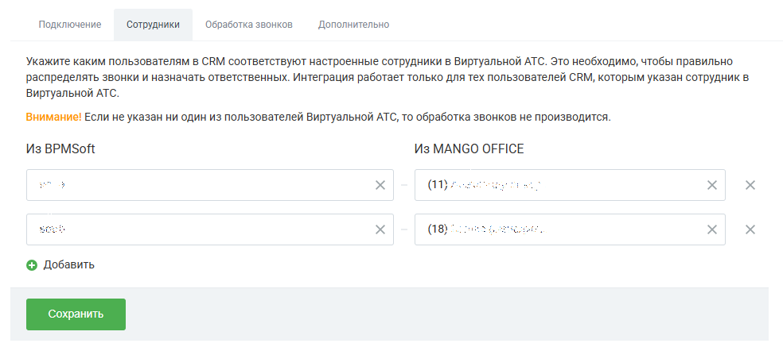

# Как настроить сопоставление сотрудников

> Трассировка: PDF §1 · сквозные стр. 18-20 · источники: ч.1 `kb/sources/integration-bpmsoft/Mango_office_integration_BPMSoft.pdf` с.18-20.

На вкладке “Сотрудники” необходимо: 1. нажмите на кнопку “Добавить”. Будут показаны поля для выбора сотрудников Виртуальной АТС и BPMSoft;

2. выберите сотрудника BPMSoft и выберите соответствующего ему сотрудника Виртуальной АТС; 3. настройте сопоставление для всех сотрудников, которые будут пользоваться интеграцией; 4. нажмите кнопку “Сохранить”. Примечание. Вкладки “Сотрудники” и “Обработка звонков” доступны после успешного подключения к BPMSoft. Руководство по интеграции АТС MANGO OFFICE и BPMSoft | Версия от 22.06.2026

В зависимости от ваших задач следует установить дополнительные настройки интеграции. Руководство по интеграции АТС MANGO OFFICE и BPMSoft | Версия от 22.06.2026
