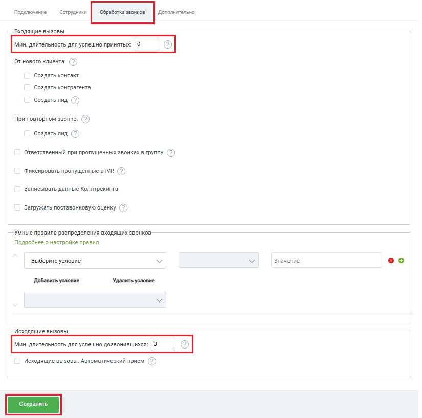

# Как настроить длительность успешно принятых и дозвонившихся

> Трассировка: PDF §2.1 · сквозные стр. 20-22 · источники: ч.1 `kb/sources/integration-bpmsoft/Mango_office_integration_BPMSoft.pdf` с.20-22.

Успешно принятый звонок – это входящий звонок, длительность которого не менее определенного значения, например, не менее 2-х секунд. Звонки с длительностью разговора менее указанного значения, будут считаться не принятыми. Успешно дозвонившийся – это исходящий звонок, длительность которого не менее определенного значения. Вы можете задать минимальную длительность звонка, например, не менее 5 секунд. Звонки с длительностью разговора менее указанного значения, будут считаться не успешными. Вы можете указать длительность успешно принятых и успешно дозвонившихся вызовов, для этого в окне “Основные настройки интеграции” нужно выполнить: 1) открыть вкладку “Обработка звонков”; 2) в поле “Мин. длительность для успешно принятых” указать минимальную длительность успешно принятого звонка; 3) прокрутить настройки обработки звонков вниз, чтобы открылись дополнительные поля; 4) в поле “Мин. длительность для успешно дозвонившихся” указать минимальную длительность успешно дозвонившегося; 5) нажать на кнопку “Сохранить”: Руководство по интеграции АТС MANGO OFFICE и BPMSoft | Версия от 22.06.2026

Руководство по интеграции АТС MANGO OFFICE и BPMSoft | Версия от 22.06.2026
