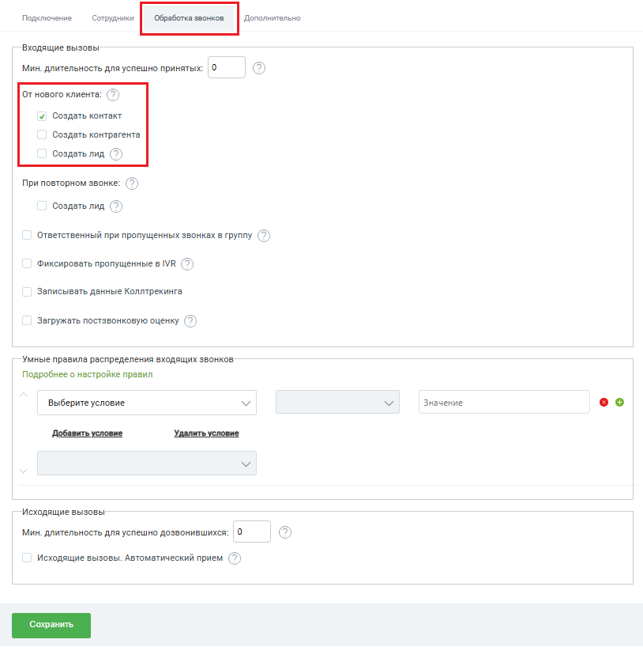
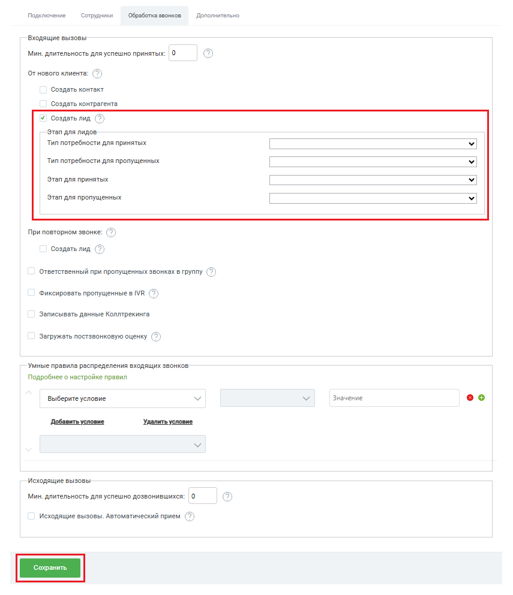

# Создавать контакт / контрагента / лид при звонках с новых номеров

> Трассировка: PDF §2.1 · сквозные стр. 22-24 · источники: ч.1 `kb/sources/integration-bpmsoft/Mango_office_integration_BPMSoft.pdf` с.22-24.

В поле “От нового клиента” вы можете выбрать способ обработки звонка с нового номера, который еще не сохранен в BPMSoft. Доступен множественный выбор: • Создать контакт; • Создать контрагента; • Создать лид. При выборе нескольких значений будут автоматически создаваться выбранные сущности. Например, если вы выбрали пункты “Создавать контакт” и “Создавать контрагента”, то для каждого принятого входящего звонка с нового номера телефона будет создан новый контакт и новый контрагент. А также, в созданной сущности сохранится номер телефона, с которого вам звонили.

Руководство по интеграции АТС MANGO OFFICE и BPMSoft | Версия от 22.06.2026 При выборе значения “Создавать лид” появляется возможность настроить тип потребности клиента и стадию лида, которая будет установлена для создаваемого лида в BPMSoft: • в выпадающих списках “Тип потребности для принятых” и “Тип потребности для пропущенных” вы можете выбрать тип потребности, на основании которого лид будет создан в BPMSoft; • в выпадающих списках “Этап для принятых” и “Этап для пропущенных” вы можете выбрать стадию, которая будет установлена для лида при принятом или пропущенном звонке. Примечание. В интерфейсе BPMSoft используются поля “Этап для принятых” и “Этап для пропущенных”. Под этапом в данном случае подразумевается стадия лида. Чтобы сохранить настройки, нужно нажать кнопку “Сохранить” внизу окна “Основные настройки интеграции”.

Руководство по интеграции АТС MANGO OFFICE и BPMSoft | Версия от 22.06.2026
