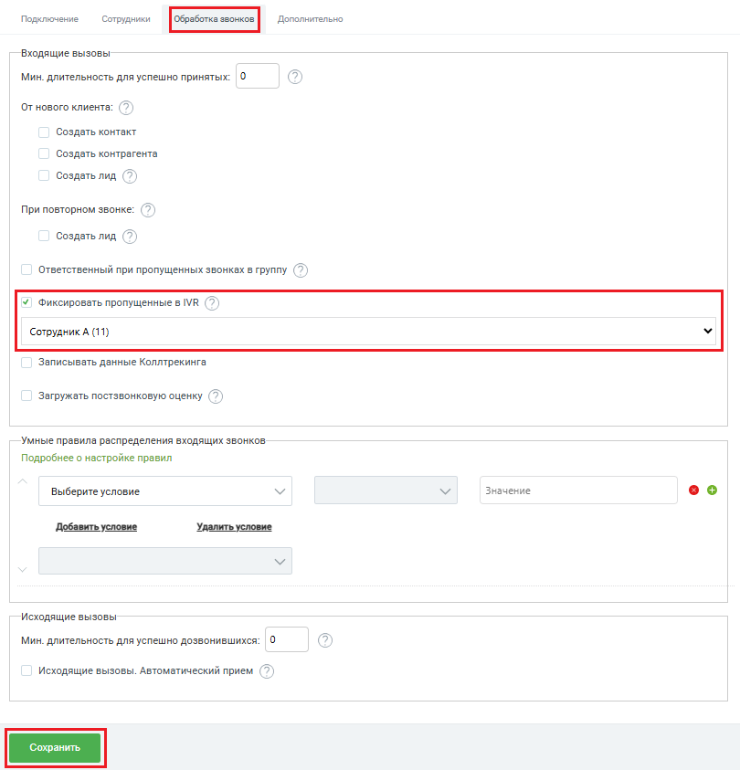

# Флаг “Фиксировать пропущенные в IVR”

> Трассировка: PDF §2.1 · сквозные стр. 25-26 · источники: ч.1 `kb/sources/integration-bpmsoft/Mango_office_integration_BPMSoft.pdf` с.25-26.

Если включен флаг “Фиксировать пропущенные в IVR”, то каждый звонок, пришедший в IVR и НЕ распределенный на сотрудника ВАТС и пропущенный, будет зафиксирован в BPMSoft, при этом ответственным за него будет указан выбранный в данной настройке сотрудник. Если флаг выключен, то звонок, пришедший в IVR, не распределенный на группу и пропущенный не фиксируется в BPMSoft. Чтобы назначить ответственного при пропущенных в IVR, в окне “Основные настройки интеграции” следует: 1) включить флаг “Фиксировать пропущенные в IVR”; 2) выбрать ответственного сотрудника; Важно! Вы можете указать ответственным только тех сотрудников, у которых есть внутренний номер Виртуальной АТС, связанный с вашим аккаунтом BPMSoft. 3) нажать на кнопку “Сохранить”:

Руководство по интеграции АТС MANGO OFFICE и BPMSoft | Версия от 22.06.2026
