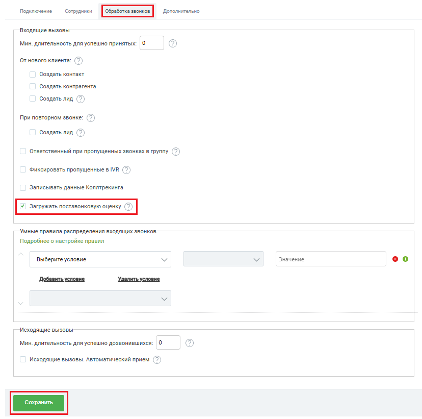

# Как подключить

> Трассировка: PDF §2.1 · сквозные стр. 26-27 · источники: ч.1 `kb/sources/integration-bpmsoft/Mango_office_integration_BPMSoft.pdf` с.26-27.

Чтобы включить передачу постзвонковой оценки в вашей BPMSoft, в основных настройках интеграции необходимо: 1) открыть закладку “Обработка звонков”; 2) активировать переключатель “Загружать постзвонковую оценку”; 3) нажать кнопку “Сохранить”: Руководство по интеграции АТС MANGO OFFICE и BPMSoft | Версия от 22.06.2026

