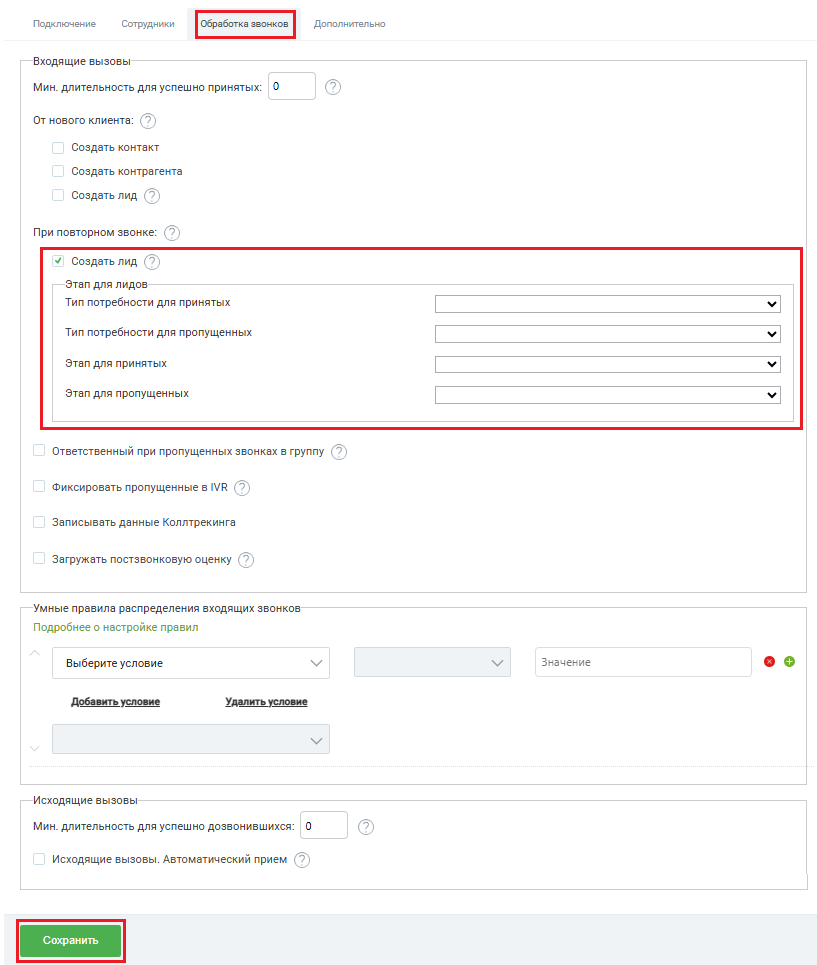

# Создать лид

> Трассировка: PDF §2.2 · сквозные стр. 27-28 · источники: ч.1 `kb/sources/integration-bpmsoft/Mango_office_integration_BPMSoft.pdf` с.27-28.

Чтобы при повторном входящем звонке, поступающем от клиента, в BPMSoft автоматически создавался лид нужно в приложении интеграции включить опцию “Создавать лид”. В настройках этой опции вы можете выбрать тип потребности клиента и стадию, на которой будут создаваться новые лиды. Вот как настраивается эта опция: 1) установить флаг “Создавать лид”. Будут показаны дополнительные поля настройки; 2) выбрать тип потребности для принятых и для пропущенных звонков; 3) выбрать стадию лида, которая будет установлена для лида, созданного при принятом или пропущенном звонке; 4) нажать на кнопку “Сохранить” внизу окна “Основные настройки интеграции”, чтобы активировать настройки. Руководство по интеграции АТС MANGO OFFICE и BPMSoft | Версия от 22.06.2026 Примечание. В интерфейсе BPMSoft используются поля “Этап для лидов”, “Этап для принятых” и “Этап для пропущенных”. Под этапом в данном случае подразумевается стадия лида.

