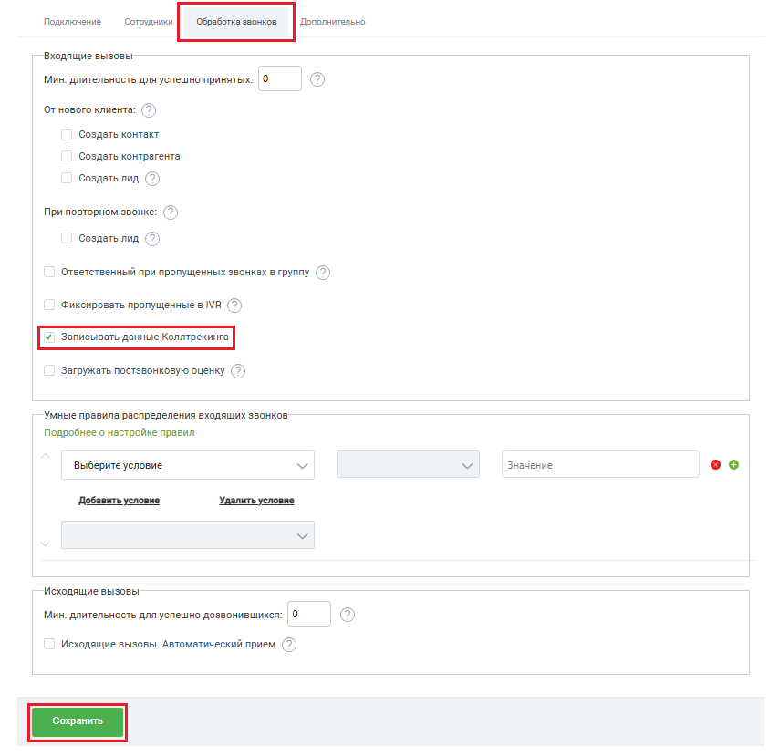

# Как включить или выключить сохранение данных коллтрекинга

> Трассировка: PDF §2.2 · сквозные стр. 30-31 · источники: ч.1 `kb/sources/integration-bpmsoft/Mango_office_integration_BPMSoft.pdf` с.30-31.

Чтобы включить сохранение данных КТ в BPMSoft, в окне “Основные настойки интеграции” на вкладке “Обработка звонков” нужно установить флаг “Записывать данные Коллтрекинга”. Чтобы выключить сохранение данных КТ – снять флаг “Записывать данные Коллтрекинга”. Примечание. Если флаг выключен, то все ранее накопленные данные коллтрекинга останутся в BPMSoft, а новые данные коллтрекинга перестанут поступать в BPMSoft. Чтобы сохранить настройки, нужно нажать кнопку “Сохранить”.

Руководство по интеграции АТС MANGO OFFICE и BPMSoft | Версия от 22.06.2026
