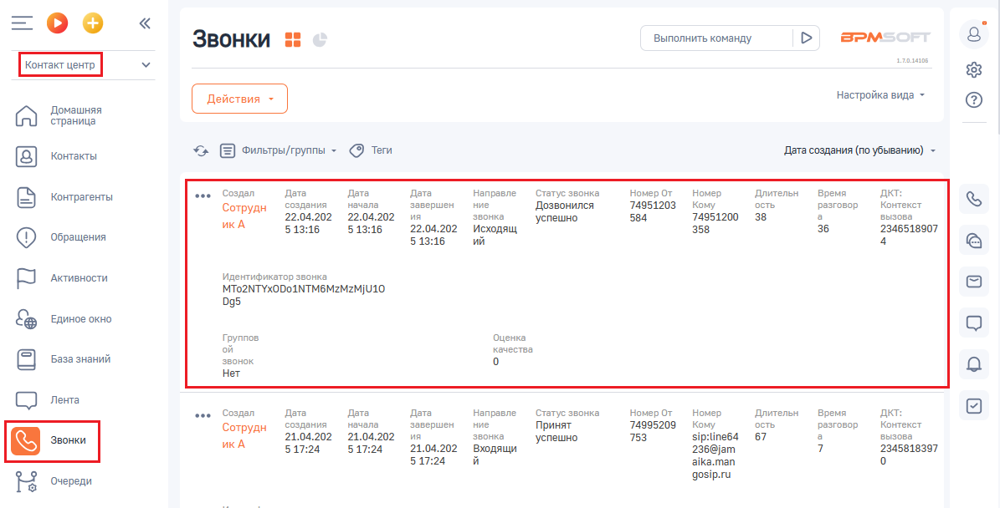
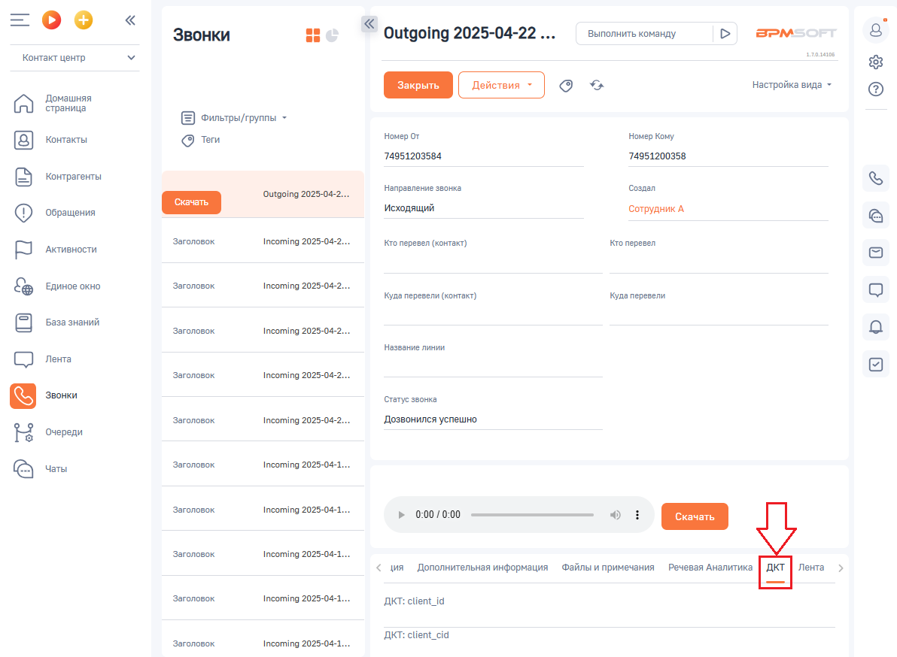
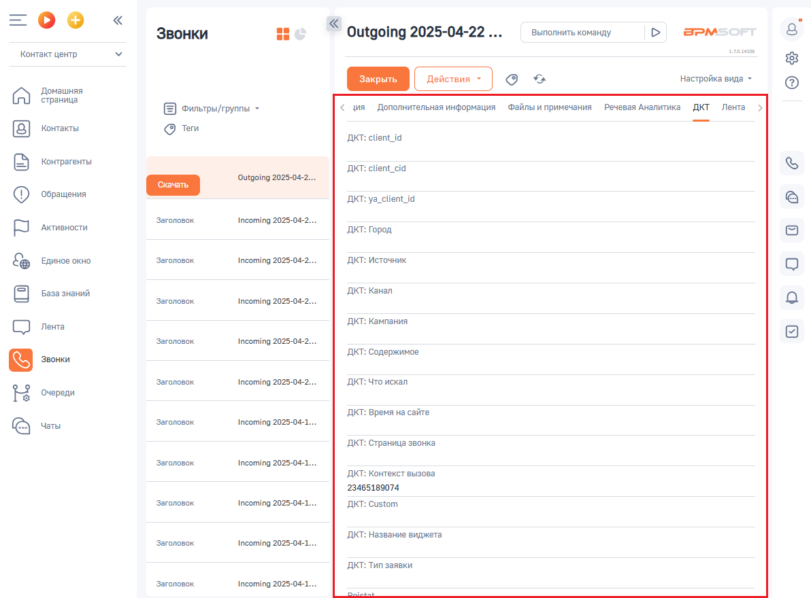

# Как посмотреть данные коллтрекинга в BPMSoft

> Трассировка: PDF §2.2 · сквозные стр. 31-32 · источники: ч.1 `kb/sources/integration-bpmsoft/Mango_office_integration_BPMSoft.pdf` с.31-32.

Данные коллтрекинга отображаются в карточке звонка на вкладке “ДКТ”. Вот как этой сделать: 1. в вашем BPMSoft откройте раздел “Контакт центр”; 2. нажмите на пункт “Звонки”; 3. нажмите на строку с данными нужного вам звонка;

4. в открывшейся карточке звонка, нажмите на вкладку “ДКТ”:

Руководство по интеграции АТС MANGO OFFICE и BPMSoft | Версия от 22.06.2026 5. данные коллтрекинга отображаются на вкладке “ДКТ”:

