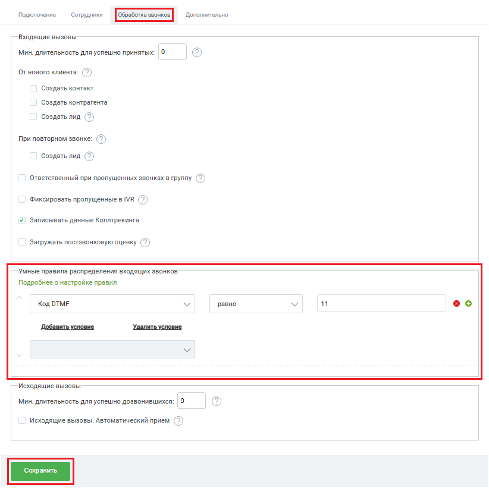
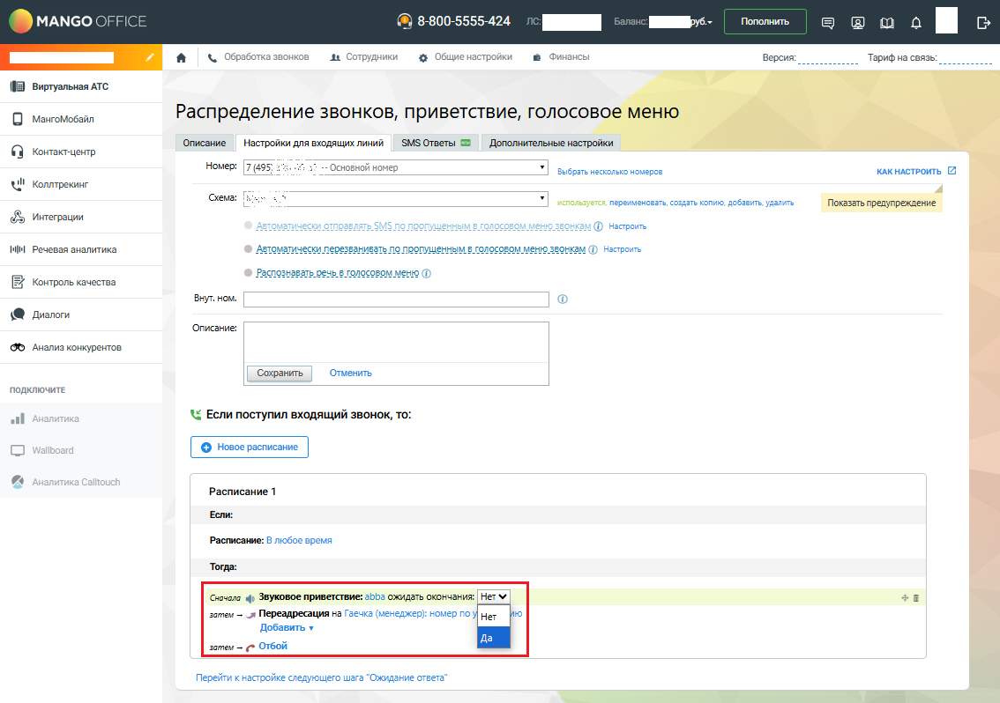
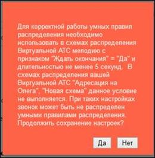
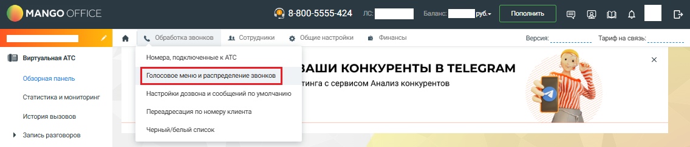

# Как создать и настроить умные правила

> Трассировка: PDF §2.2 · сквозные стр. 32-35 · источники: ч.1 `kb/sources/integration-bpmsoft/Mango_office_integration_BPMSoft.pdf` с.32-35.

1) Вам нужно открыть вкладку “Обработка звонков” и прокрутить эту вкладку вниз так, чтобы была видна группа полей “Умные правила распределения входящих вызовов”; 2) настроить собственный алгоритм распределения, указав правила обработки звонка. Можно указать до 20 правил и 5 условий в каждом правиле. При звонке правила анализируются в настроенном порядке, сверху-вниз. Для изменения порядка правил нужно нажать на стрелки

вверх и/или вниз необходимое количество раз;

3) для добавления нового правила нужно нажать кнопку или ссылку

“Добавить условие”, для удаления – кнопку или ссылку “Удалить условие”; Руководство по интеграции АТС MANGO OFFICE и BPMSoft | Версия от 22.06.2026 4) при настройке правила указать, какое значение анализировать: – из данных о текущем звонке; – из данных Виртуальной АТС; – из BPMSoft (для этого в CRM выполняется поиск по номеру звонящего и для найденного клиента выполняется анализ данных). По всем полям, в том числе пользовательским, а также по тэгам; 5. указать операцию сравнения (“равно”, “не равно”, “содержит” и т.д.) и указать, с каким значением необходимо сравнивать; 6. указать, какое действие необходимо выполнить, если результат проверки будет успешным (переадресовать на номер, переадресовать на ответственного и другие); 7. если результат проверки правила не будет успешным, то будет проверяться следующее правило. Если ни одно правило не подошло, то звонок будет обрабатываться по схеме переадресации, настроенной в Личном кабинете Виртуальной АТС; 8. чтобы сохранить настройки, нужно нажать кнопку “Сохранить”.

Руководство по интеграции АТС MANGO OFFICE и BPMSoft | Версия от 22.06.2026 Обратите внимание! Чтобы виджет мог выполнить анализ данных о звонке/клиенте, необходимо настроить схему распределения вызовов следующим образом: 1) установить звуковое приветствие, длительностью не менее 5-8 сек. Не рекомендуется устанавливать звуковое приветствие “Гудок” или “Тишина”, тем более, если вы настраиваете распределение входящих звонков на этапе ввода Клиентом DTMF-команд; 2) звуковому приветствию присвоить признак “Да” в поле “ожидать окончания”:

Тогда, при звонке, во время проигрывания приветствия, виджет выполнит анализ данных о звонке/клиенте и обработает вызов согласно настроенному умному правилу распределения вызовов. Важно! Если вы не выполните указанные выше требования к схеме распределения вызовов, то: 1) ваши звонки не будут обработаны умными правилами распределения звонков; 2) при настройке умных правил будет выдано следующее сообщение:

Руководство по интеграции АТС MANGO OFFICE и BPMSoft | Версия от 22.06.2026 Для устранения ошибки необходимо перейти в Личный кабинет Виртуальной АТС, открыть в раздел “Голосовое меню и распределение звонков” (см. рисунок ниже) и настроить схему распределения вызовов так, чтобы она соответствовала указанным выше требованиям.

