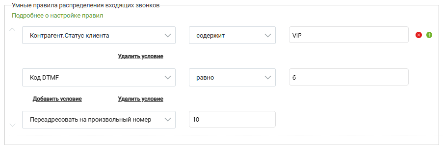
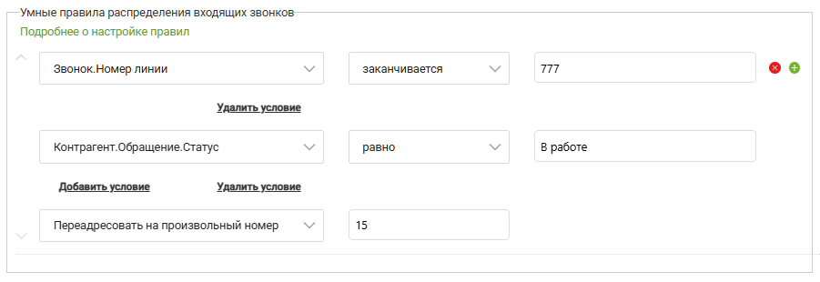

# Примеры настройки умного алгоритма распределения

> Трассировка: PDF §2.2 · сквозные стр. 35-36 · источники: ч.1 `kb/sources/integration-bpmsoft/Mango_office_integration_BPMSoft.pdf` с.35-36.

Пример 1. Звонит VIP-клиент. В IVR пользователь выбирает номер, соответствующий отделу технической поддержки. Его необходимо автоматически распределить на группу, занимающуюся VIP-клиентами. Пример настройки умных правил показан на рисунке:

Пример 2. Звонит Клиент в техническую поддержку. Если есть открытое обращение – распределяем на ответственного. Если занят – на произвольный номер.

Руководство по интеграции АТС MANGO OFFICE и BPMSoft | Версия от 22.06.2026
