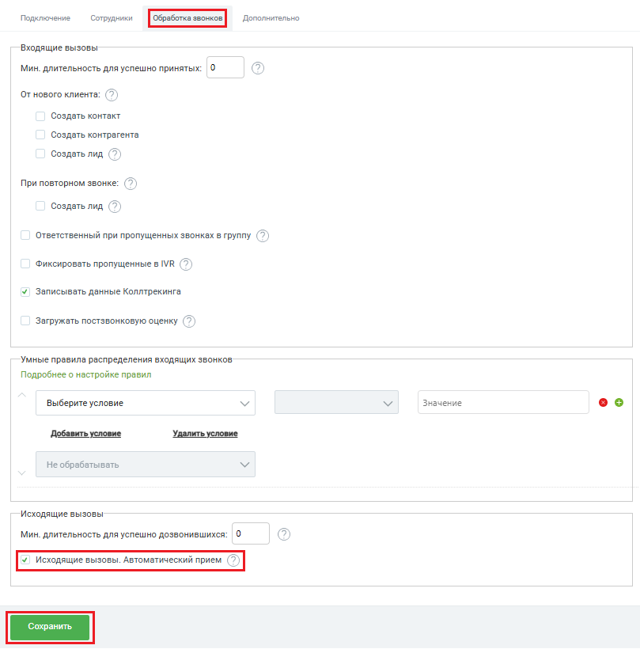

# Исходящий звонок по клику из BPMSoft

> Трассировка: PDF §2.3 · сквозные стр. 36-37 · источники: ч.1 `kb/sources/integration-bpmsoft/Mango_office_integration_BPMSoft.pdf` с.36-37.

Приложение поддерживает возможность исходящего звонка в один клик по номеру телефона. Если эта опция включена, тогда сотрудник может кликнуть на номер телефона клиента в BPMSoft, будет выполнен звонок клиенту, а в BPMSoft показана карточка исходящего звонка. Чтобы включить или выключить эту опцию, в окне “Основные настройки интеграции” следует: 1) включить флаг “Исходящие вызовы. Автоматический прием”; 2) нажать на кнопку “Сохранить” внизу окна “Основные настройки интеграции”:

Руководство по интеграции АТС MANGO OFFICE и BPMSoft | Версия от 22.06.2026
