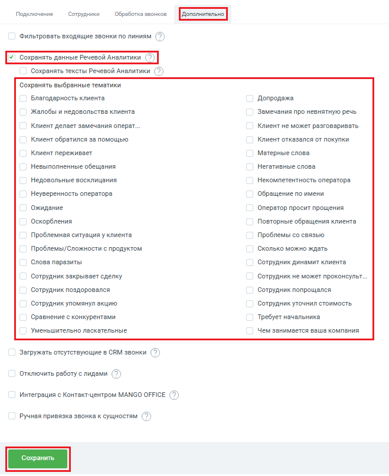
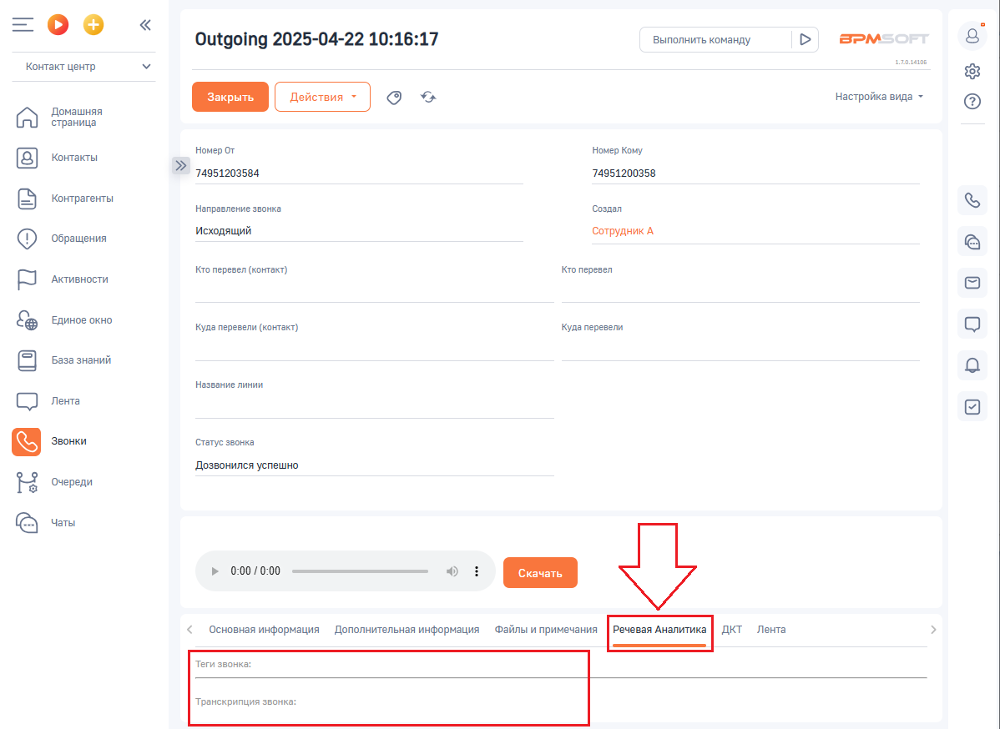

# Сохранение тематик разговоров

> Трассировка: PDF §2.4 · сквозные стр. 37-40 · источники: ч.1 `kb/sources/integration-bpmsoft/Mango_office_integration_BPMSoft.pdf` с.37-40.

Общие сведения Интеграция Виртуальной АТС с BPMSoft предоставляет возможность сохранять тематики разговоров, которые помогут вам понять (без прослушивания записи разговора), использовались ли в речи обязательные слова, стоп-слова или ненормативная лексика, автоматически выявлять разговоры, в которых клиент интересовался тем или иным продуктом или выражал недовольство, конфликтовал с оператором и прочее. Перечислим некоторые из преимуществ, которые дают тематики разговоров в BPMSoft: • Руководитель отдела продаж, не прослушивая записи разговора, может: – увидеть сделано ли клиенту предложение купить тот или иной продукт, была ли попытка up-sale, что напрямую влияет на средний чек; – провести анализ проваленных сделок на основе информации о том, какие “ключевые теги” использовались в разговорах, например: дорого, нет нужного размера/конфигурации, наименование конкурента и т.д.; – автоматически предоставлять отчетность для отдела маркетинга, для экономии времени; • Руководитель отдела технической поддержки клиентского сервиса может контролировать использование обязательных или “стоп” слов (например, “я буду жаловаться, ужасный сервис”) и диалоге с клиентом, что позволит повысить качество обслуживания клиентов, быстро выявить и исправить какую-то проблему; – Маркетолог, при анализе эффективности рекламных кампаний, может: • определить целевым или нецелевым было обращение; • с каким первичным интересом приходят входящие звонки (например, чтобы сравнить между собой конкурирующие продукты) и как часто они закрываются в сделки. Руководство по интеграции АТС MANGO OFFICE и BPMSoft | Версия от 22.06.2026 Как это работает В случае, если пользователю BPMSoft поступил звонок, сервис Речевой аналитики определит тематику разговора, а сервис интеграции сохранит название тематики в карточке звонка на специальной вкладке “Речевая аналитика”. В настройках функции сохранения данных РА вы можете выбрать тематики разговора, которые будут сохраняться. После завершения разговора с клиентом, сервис РА анализирует разговор и относит его к той или иной тематике. Если в разговоре определена тематика, выбранная вами в настройках функции “Сохранять данные Речевой аналитики”, то название тематики сохраняется в BPMSoft. Вы можете в сервисе Речевой аналитики не только настроить поиск определенных тематик в разговоре, но и контролировать ОТСУТСТВИЕ слова или фразы в разговоре. Исключение тематик позволяет: • найти контакты, не имеющие отношение к продажам ваших товаров или услуг; • оптимизировать работу операторов, определив круг тематик разговоров с клиентами; • создавать отчеты в BPMSoft, в которых приведены обобщённые данные, отфильтровав при этом узкие или “нишевые” тематики. Как включить сохранение тематик Чтобы включить сохранение данных Речевой аналитики, в окне “Основные настройки интеграции” следует: 1) открыть вкладку “Дополнительно”; 2) установить флаг “Сохранять данные Речевой Аналитики”; 3) выбрать тематики, которые нужно сохранять; 4) нажать на кнопку “Сохранить” внизу окна “Основные настройки интеграции”: Руководство по интеграции АТС MANGO OFFICE и BPMSoft | Версия от 22.06.2026

Руководство по интеграции АТС MANGO OFFICE и BPMSoft | Версия от 22.06.2026 Как посмотреть тематику разговора Чтобы посмотреть тематики речи, распознанные в диалоге с клиентом, BPMSoft необходимо: 1) перейти в Контакт-Центр; 2) перейти в раздел “Звонки”; 3) дважды нажать на строку с данными звонка; 4) перейти на вкладку “Речевая аналитика”. Вы увидите перечень распознанных тематик:

