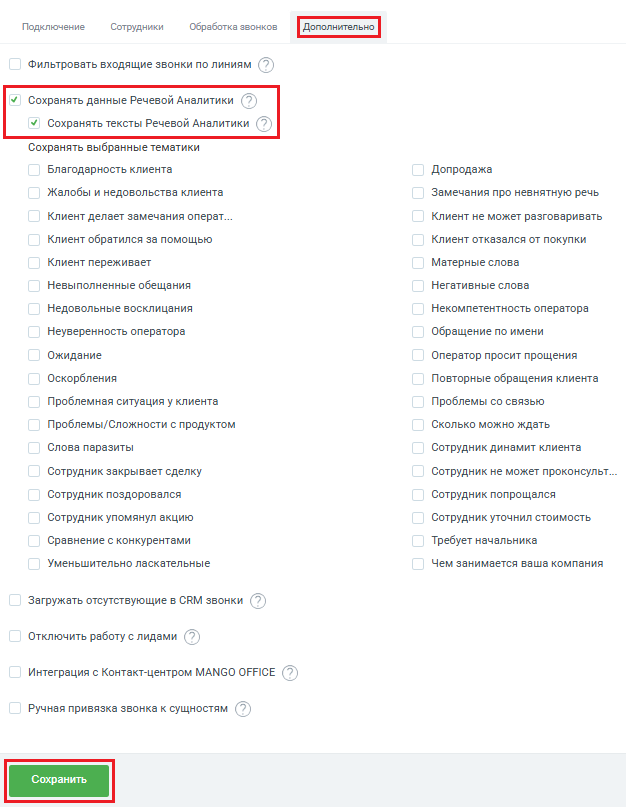

# Как настроить

> Трассировка: PDF §2.4 · сквозные стр. 41-42 · источники: ч.1 `kb/sources/integration-bpmsoft/Mango_office_integration_BPMSoft.pdf` с.41-42.

Чтобы включить функцию сохранения тематик Речевой аналитики, в окне “Основные настройки интеграции” следует: 1) открыть вкладку “Дополнительно”; 2) установить флаг “Сохранять тексты Речевой Аналитики”; 3) нажать на кнопку “Сохранить” внизу окна “Основные настройки интеграции”:

Руководство по интеграции АТС MANGO OFFICE и BPMSoft | Версия от 22.06.2026
