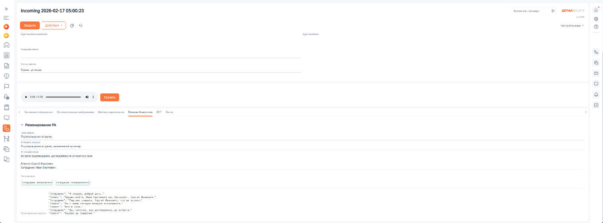

# Как посмотреть распознанный текст

> Трассировка: PDF §2.4 · сквозные стр. 42 · источники: ч.1 `kb/sources/integration-bpmsoft/Mango_office_integration_BPMSoft.pdf` с.42.

Чтобы посмотреть текст, распознанный в диалоге с клиентом, BPMSoft необходимо: 1) открыть в Контакт-Центр; 2) открыть раздел “Звонки”; 3) дважды нажать на строку с данными звонка; 4) открыть на вкладку “Речевая аналитика”. Вы увидите распознанный текст:

Резюме разговора
