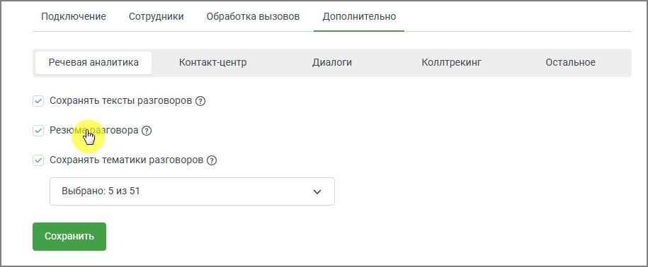
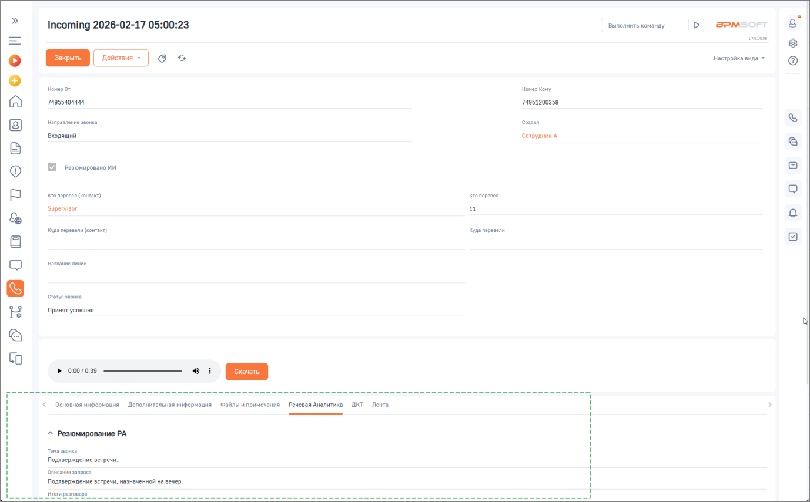

# Как включить сохранение резюме разговора

> Трассировка: PDF §2.4 · сквозные стр. 43-44 · источники: ч.1 `kb/sources/integration-bpmsoft/Mango_office_integration_BPMSoft.pdf` с.43-44.

Чтобы включить сохранение резюме разговоров в BPMSoft, в основных настройках интеграции необходимо: • открыть вкладку «Дополнительно»; • установить флаг «Резюме разговора»; • нажать кнопку «Сохранить».

После включения настройки резюме разговоров будет автоматически подгружаться в интерфейс BPMSoft для обработанных звонков. Руководство по интеграции АТС MANGO OFFICE и BPMSoft | Версия от 22.06.2026

