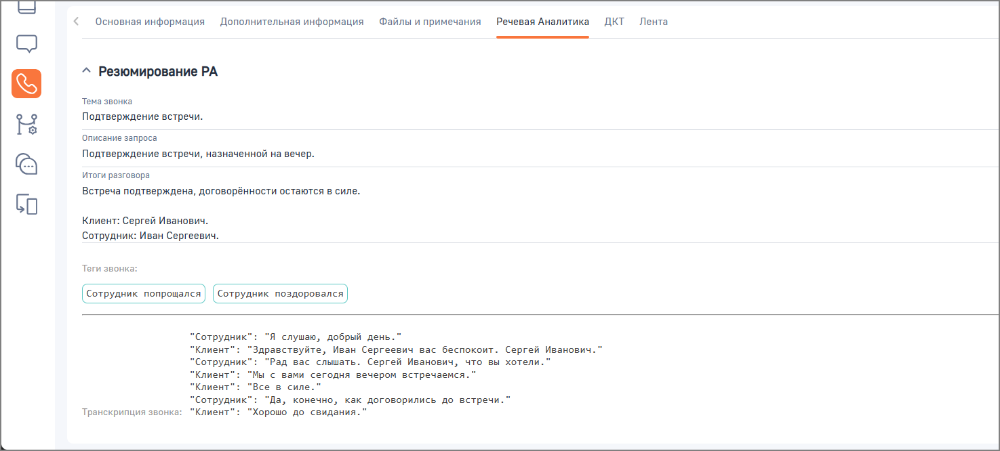

# Как посмотреть резюме разговора

> Трассировка: PDF §2.4 · сквозные стр. 44-45 · источники: ч.1 `kb/sources/integration-bpmsoft/Mango_office_integration_BPMSoft.pdf` с.44-45.

Чтобы посмотреть резюме разговора в BPMSoft, необходимо: • перейти в раздел «Контакт-центр»; • открыть раздел «Звонки»; • дважды нажать на строку с данными нужного звонка; • ознакомиться с резюме разговора в карточке звонка. Руководство по интеграции АТС MANGO OFFICE и BPMSoft | Версия от 22.06.2026

Резюме разговора предназначено для оперативного анализа взаимодействия с клиентом и может использоваться руководителями и операторами при работе со звонками.
